# AntiFan — Super Deep Codebase Audit: Strategic Critique & Advisory (v2.0 Final Consensus)
## Bản Thẩm Định Kỹ Thuật Độc Lập: Chuẩn Hóa Lộ Trình 5 Tầng, Khung Vi Phân Sparse, Ma Trận Quy Thuộc 2 Trục & Ranh Giới Đóng Băng Core

**Ngày hoàn thiện:** 2026-09-04  
**Tài liệu đối chiếu:** `E:\Download\AntiFan-Super-Deep-Audit-and-Final-Roadmap-2026-09-04.md` & Phản biện kỹ thuật trực tiếp  
**Dự án:** `antifan-browser-desktop`  
**Git HEAD kiểm toán:** `90b1c8c` (Baseline tính năng: `7ec1d7e` & `bc7d01a`)  
**Phương pháp luận:** `ak:fable-thinking` (Floor Gate • Claim Discipline • Attack Pass • Zero Hallucination)

---

## 1. PHÁN QUYẾT TỔNG THỂ: SỰ HỢP NHẤT CHIẾN LƯỢC (ARCHITECTURAL CONVERGENCE)

Toàn bộ ban kỹ thuật và Khổng Minh đạt được **sự đồng thuận tuyệt đối về hướng đi kiến trúc**:
$$\mathbf{Core\ Verification\ \longrightarrow\ Unified\ Task\ Contract\ \longrightarrow\ Closed-Loop\ Execution\ \longrightarrow\ 3\ Storefront\ Workflows\ \longrightarrow\ Reliability}$$

Tuy nhiên, áp dụng nguyên tắc **"Locked architectural direction, not locked implementation details"**, chúng ta loại bỏ sự cứng nhắc mang tính giáo điều (schema-first / dogmatic freeze) và thống nhất **14 điều chỉnh cốt lõi** dưới đây.

---

## 2. BỐN ĐỘT PHÁ KỸ THUẬT QUAN TRỌNG NHẤT (THE 4 TECHNICAL UPGRADES)

```mermaid
flowchart TD
    subgraph SparseDelta [1. Sparse Scoped Delta]
        T1[Action Target] --> H1[Target Node]
        H1 --> H2[Bounded Subtree]
        H2 --> H3[Related Overlay / Portal]
        H3 --> H4[Document Level Effects]
    end

    subgraph TwoAxisAttribution [2. Ma Trận Quy Thuộc 2 Trục]
        C[Causality: DIRECT / INDIRECT / UNRELATED / UNKNOWN]
        S[Scope: TARGET / RELATED / AMBIENT / UNKNOWN]
        C --- S
    end

    subgraph TwoGateFreeze [3. Core Freeze 2 Cổng]
        G1[GATE A: Structural Regression Green]
        G2[GATE B: 5 Golden E2E Scenarios Pass]
        G1 & G2 --> CF[CORE FEATURE FREEZE]
    end

    subgraph LineageChain [4. Chuỗi Phả Hệ Causal Lineage]
        REQ[Request] --> TSK[Task] --> EVI[Evidence + Provenance]
        EVI --> ACT[Action] --> MUT[Mutation Lineage]
        MUT --> OBS[Observation] --> VER[Verification Gate] --> ART[Artifact Lineage]
    end
```



### 2.1. Interaction Delta: Bằng chứng thưa thớt (Sparse Evidence) trên Phân cấp 4 tầng (Scope Hierarchy)
* **Sai lầm trước đây:** Ép buộc một vector 6D đầy đủ ($\Delta\text{DOM}, \Delta\text{Style}, \Delta\text{Geometry}, \Delta\text{Visibility}, \Delta\text{ARIA}, \Delta\text{URL}$) lên mọi action $\implies$ sinh rác telemetry và tính toán vô ích.
* **Giải pháp chuẩn hóa:**
  1. **Sparse Representation:** Chỉ ghi nhận chiều nào thực sự có biến thiên; chiều không đổi sẽ không sinh noise.
  2. **Hierarchy Scope:** Bounded Subtree là chưa đủ vì các hành động như bấm nút mở modal/drawer thường sinh portal gắn trực tiếp vào `document.body` (đã được đối chiếu trong `browser-control-port.ts:1672`). Do đó, scope phải phân thành 4 tầng:
     $$\mathbf{Target\ Node\ \longrightarrow\ Bounded\ Subtree\ \longrightarrow\ Related\ Overlay/Portal\ \longrightarrow\ Document\ Effects\ (Scroll\ lock,\ Body\ classes)}$$

### 2.2. Mutation Attribution: Phân định 2 trục độc lập kết hợp Dòng thời gian (Temporal Lineage)
* **Sai lầm trước đây:** Dùng 3 nhãn gộp `RELEVANT / AMBIENT / UNKNOWN` $\implies$ nhầm lẫn giữa phạm vi không gian và hệ quả nhân quả (ví dụ: click Add to cart làm rerender recommendation component không phải ambient ngẫu nhiên, mà là hệ quả gián tiếp).
* **Giải pháp chuẩn hóa:** Tách biệt 2 trục độc lập:
  - **Trục Nhân quả (Causality):** `DIRECT`, `INDIRECT`, `UNRELATED`, `UNKNOWN`.
  - **Trục Phạm vi (Scope):** `TARGET`, `RELATED`, `AMBIENT`, `UNKNOWN`.
  - **Dòng thời gian (Temporal Lineage):** Mỗi mutation gắn với độ lệch thời gian so với thời điểm kích hoạt action ($T_0$):
    $$Action\ (T_0) \longrightarrow m_1\ (+25\text{ms}) \longrightarrow m_2\ (+180\text{ms}) \longrightarrow m_3\ (+450\text{ms})$$
    Phân loại dựa trên sự kết hợp giữa **Thời gian + Không gian + Ngữ nghĩa**.

### 2.3. Core Feature Freeze: Mô hình 2 Cổng (Gate A & Gate B)
* **Sai lầm trước đây:** Tuyên bố Core đã sẵn sàng đóng băng chỉ dựa trên việc bộ test hiện tại đang pass (101/101 tests pass). Điều này chưa kiểm chứng được tương tác thực tế với trình duyệt thật, OMP thật và PTY thật.
* **Giải pháp chuẩn hóa:** Core chỉ được đóng băng khi vượt qua cả 2 cổng:
  - **GATE A (Structural / Regression):** 100% test unit/integration và kiểm tra kiểu dữ liệu sạch lỗi.
  - **GATE B (Golden E2E Scenarios):** Vượt qua 5 kịch bản thực tế trên trình duyệt sống:
    1. *Open menu / Disclosure:* Kiểm chứng sparse delta + overlay hierarchy.
    2. *Add to cart / Drawer:* Kiểm chứng attribution gián tiếp (badge update + drawer slide).
    3. *Responsive Header:* Kiểm chứng co giãn layout + không tràn ngang (`hasHorizontalOverflow === false`).
    4. *Annotation $\to$ Task Contract $\to$ OMP $\to$ Verify:* Kiểm chứng vòng lặp khép kín.
    5. *Broken Interaction:* Kiểm chứng cơ chế Fail-Closed (từ chối khẳng định bậy khi action không tạo ra hiệu ứng).

### 2.4. Khung Phả Hệ Tác Vụ (Artifact & Causal Lineage)
* Thay vì chỉ gom dữ liệu rời rạc, Unified Task Context phải trả lời được câu hỏi mang tính pháp lý của kỹ thuật độ tin cậy:
  $$\mathbf{Tại\ sao\ AntiFan\ tin\ rằng\ tác\ vụ\ này\ đã\ HOÀN\ THÀNH\ (VERIFIED)?}$$
* Chuỗi ID liên kết xuyên suốt:
  `taskId` $\to$ `evidenceId (kèm Provenance)` $\to$ `actionId` $\to$ `mutationRevision` $\to$ `observationId` $\to$ `verificationId` $\to$ `artifactId`.
* **Evidence Provenance:** Mọi bằng chứng phải ghi rõ nguồn gốc (`source: 'annotation' | 'browser' | 'user_claim' | 'inference'`), thời điểm thu thập (`capturedAt`) và độ tin cậy (`confidence`) để OMP không nhầm lẫn giữa quan sát thực tế và giả định.

---

## 3. LỘ TRÌNH 5 TẦNG ĐÃ ĐƯỢC ĐIỀU CHỈNH (CALIBRATED 5-TIER ROADMAP)

```text
================================================================================
P0 — VERIFICATION COMPLETION & DUAL-GATE CORE FREEZE
--------------------------------------------------------------------------------
1. Sparse Interaction Delta
   - Cấu trúc sparse (chỉ ghi nhận chiều thay đổi).
   - Phân cấp 4 tầng: Target -> Bounded Subtree -> Related Portal -> Document Effects.
2. Complete Mutation Attribution
   - Ma trận 2 trục: Causality (Direct/Indirect/Unrelated) x Scope (Target/Related/Ambient).
   - Temporal Lineage (Action T0 -> Mutation T_offset).
3. Dual-Gate Freeze Execution
   - GATE A: Structural & Regression Green.
   - GATE B: 5 Golden E2E Scenarios Green.
   └──➔ THỰC HIỆN NGHI THỨC: CORE FEATURE FREEZE

================================================================================
P1 — CANONICAL TASK CONTRACT & UNIFIED INGRESS
--------------------------------------------------------------------------------
4. Canonical Task Data Structure
   - Request (User directive, raw prompt).
   - Context (Workspace, URLs, Git branch, environment).
   - Evidence với Provenance bắt buộc (Observation vs Inference).
   - Acceptance Criteria & Verification Plan.
   - Artifact Lineage IDs (taskId -> evidenceId -> actionId -> ...).
5. Unified Ingress Pipeline
   - Chat / Annotation / CLI Direct Prompt -> cùng một TaskResolver -> Unified Task Context.
   - TaskIntent đóng vai trò Routing Hint (primaryIntent + secondaryIntents[]), không phải chân lý tuyệt đối.

================================================================================
P1 — CLOSED-LOOP AGENT EXECUTION
--------------------------------------------------------------------------------
6. OMP <-> AntiFan Repair Loop
   - Task Context -> OMP Plan/Edit -> AntiFan Render/Observe -> Verification Gate.
   - Bounded Repair Budget: Mặc định defaultRepairBudget = 2, cho phép cấu hình theo ngữ cảnh (0..N).

================================================================================
P1 — TWO-TIER WORKFLOW ROLLOUT (CHUNG 1 CORE RUNTIME & 1 TASK CONTRACT)
--------------------------------------------------------------------------------
7. Tier A (Ưu tiên thực chiến cao nhất):
   - Workflow 1: Screenshot / Reference -> Clone Storefront.
   - Workflow 2: QA Finding -> Closed-Loop Repair.
8. Tier B (Triển khai sau khi Tier A hoàn thiện):
   - Workflow 3: Figma Design Tokens -> Liquid / Tailwind Theme.

================================================================================
P2 — RELIABILITY, ENDURANCE & PRODUCTIZATION
--------------------------------------------------------------------------------
9. Đo kiểm ngâm tải 8 tiếng (8h continuous soak benchmark) định kỳ cho bản phát hành.
10. Tối ưu UX duyệt lịch sử Artifact, dọn dẹp vệ sinh PTY process và tinh giản bộ nhớ.
================================================================================
```

---

## 4. QUY TẮC THÉP LOẠI TRỪ ĐỀ XUẤT (THE GOLDEN REJECTION RULE V2)

Để ngăn chặn tuyệt đối tình trạng phình to tính năng (Feature Creep) và giữ cho AntiFan là một runtime tinh gọn, sắc bén:

$$\mathbf{CHỈ\ CHẤP\ NHẬN\ một\ đề\ xuất\ mới\ nếu\ nó\ thỏa\ mãn\ ít\ nhất\ 1\ trong\ 3\ điều\ kiện:}$$
1. **Trực tiếp phục vụ** một luồng công việc thực tế của frontend / storefront theme.
2. **Triệt tiêu một cơ chế lỗi đã được chứng minh** (Proven Core Failure Mode).
3. **Giảm thiểu độ phức tạp kiến trúc hoặc rủi ro** của một năng lực cốt lõi bắt buộc.

$$\mathbf{Mọi\ trường\ hợp\ khác\ \implies\ BÁC\ BỎ\ THẲNG\ TAY\ (REJECT).}$$

---

## 5. KẾT LUẬN

AntiFan hiện tại **không cần thêm "trí tuệ nhân tạo" hay các subsystem cồng kềnh**. Nhiệm vụ tối thượng lúc này là:
$$\mathbf{Nối\ các\ mắt\ xích\ đã\ có\ thành\ một\ Vòng\ đời\ Tác\ vụ\ Nhân\ quả\ duy\ nhất\ (Causal\ Task\ Lifecycle)}$$
$$\text{REQUEST} \to \text{TASK} \to \text{EVIDENCE} \to \text{OMP} \to \text{ACTION} \to \text{MUTATION} \to \text{OBSERVATION} \to \text{VERIFICATION} \to \text{REPAIR} \to \text{PASS}$$

Khi chuỗi này hoạt động với bằng chứng thực nghiệm, phân cấp không gian chuẩn xác và nguyên tắc đóng cửa khi lỗi (fail-closed), AntiFan sẽ trở thành một **nền tảng thực thi và kiểm chứng bất khả chiến bại** cho công việc lập trình theme của bạn.
