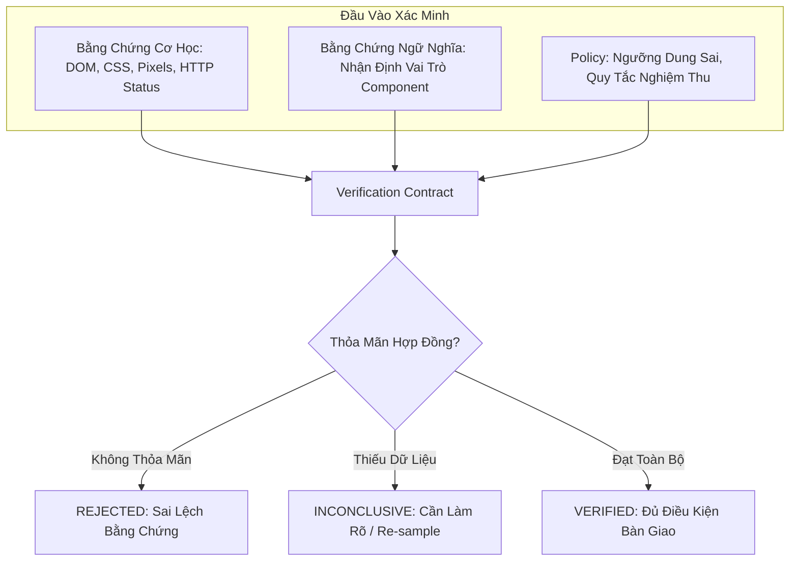
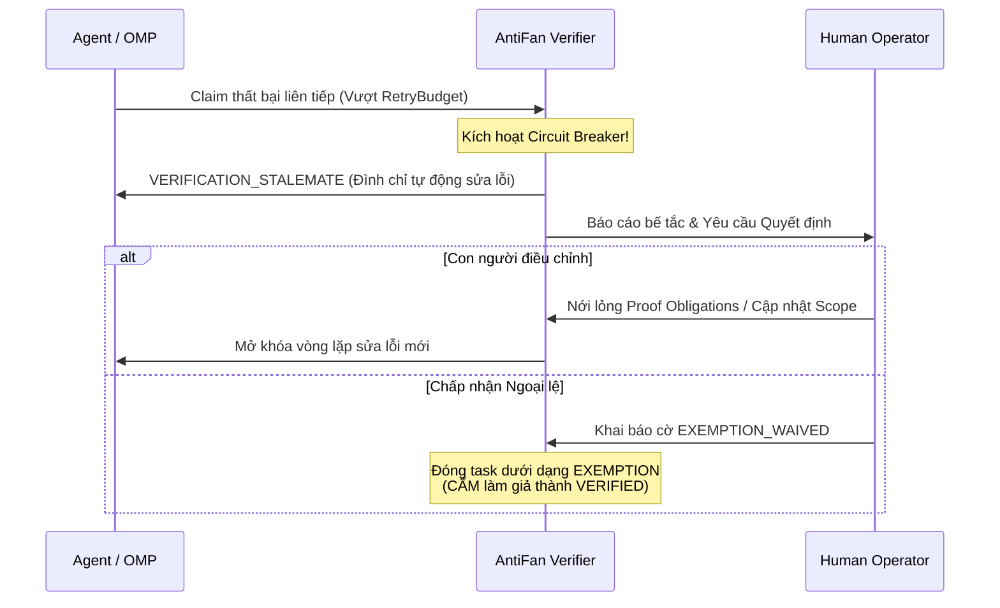

# AntiFan — Universal Web/UI Understanding Runtime
## Báo Cáo Chiến Lược Kiến Trúc Tối Hậu & Đại Tổng Hợp Phản Biện (Grand Synthesis)

* **Ngày thực hiện:** 2026-09-04
* **Tài liệu phân tích gốc:** `E:/Download/AntiFan-Universal-WebUI-Runtime-Strategic-Report-2026-09-03.md`
* **Môi trường đối chiếu:** `E:/Work/apps/antifan-browser-desktop`
* **Audited Git HEAD:** `feec367158d890aca154576e3fdd78d0338243da` (`perf(sensory): execute 20-round optimization loop on sensory tools and quality gate`)
* **Phiên bản Runtime:** `1.3.5` (Production Baseline)
* **Phương pháp luận:** `ak:brainstorm` + `ak:fable-thinking` (KongMing Advisory Supervision & Grand Peer Red-Teaming)

---

## MỤC LỤC
1. [BƯỚC NGOẶT ĐỊNH VỊ CỐT LÕI (EXECUTIVE PARADIGM SHIFT)](#1-bước-ngoặt-định-vị-cốt-lõi-executive-paradigm-shift)
2. [NGŨ ĐẠI NGUYÊN THỦY CỦA CORE (THE 5 LEAN PRIMITIVES)](#2-ngũ-đại-nguyên-thủy-của-core-the-5-lean-primitives)
3. [RANH GIỚI 4 TẦNG BẤT BIẾN (THE HARD 4-TIER BOUNDARY)](#3-ranh-giới-4-tầng-bất-biến-the-hard-4-tier-boundary)
4. [HỌC THUYẾT ANTI-HALLUCINATION & BỘ TỨ KHẨU QUYẾT TỐI CAO](#4-học-thuyết-anti-hallucination--bộ-tứ-khẩu-quyết-tối-cao)
5. [BẢN GIAO KÈO XÁC MINH (VERIFICATION CONTRACT)](#5-bản-giao-kèo-xác-minh-verification-contract)
6. [TRỰC QUAN HÌNH HỌC: VISUALREGION (CORE) VS. INFERREDENTITY (OMP)](#6-trực-quan-hình-học-visualregion-core-vs-inferredentity-omp)
7. [KIỂM CHỨNG DỰA TRÊN RỦI RO (RISK-BASED VERIFICATION) & CHỐNG "QA POLICE"](#7-kiểm-chứng-dựa-trên-rủi-ro-risk-based-verification--chống-qa-police)
8. [MA TRẬN PHÁN QUYẾT TINH GỌN & 4 MÃ LÝ DO INCONCLUSIVE](#8-ma-trận-phán-quyết-tinh-gọn--4-mã-lý-do-inconclusive)
9. [CƠ CHẾ CHỐNG LIVELOCK: RETRY BUDGET & VERIFICATION_STALEMATE](#9-cơ-chế-chống-livelock-retry-budget--verification_stalemate)
10. [TRẢ THEME_READY VỀ ĐÚNG WORKFLOW (CẤM GOD GATE TRONG CORE)](#10-trả-theme_ready-về-đúng-workflow-cấm-god-gate-trong-core)
11. [HỒ SƠ BẰNG CHỨNG (PROOF PROFILE) THAY THẾ ĐIỂM SỐ VÔ HỒN](#11-hồ-sơ-bằng-chứng-proof-profile-thay-thế-điểm-số-vô-hồn)
12. [ĐỐI CHIẾU MÃ NGUỒN HEAD FEEC367 & TÁI ĐỊNH DANH HẠNG MỤC P1/P2](#12-đối-chiếu-mã-nguồn-head-feec367--tái-định-danh-hạng-mục-p1p2)
13. [LỘ TRÌNH THỰC THI 6 GIAI ĐOẠN & MA TRẬN BENCHMARK A-F](#13-lộ-trình-thực-thi-6-giai-đoạn--ma-trận-benchmark-a-f)
14. [HỢP ĐỒNG BÀN GIAO TRIỂN KHAI (BOUNDED DELIVERY CONTRACT)](#14-hợp-đồng-bàn-giao-triển-khai-bounded-delivery-contract)

---

## 1. BƯỚC NGOẶT ĐỊNH VỊ CỐT LÕI (EXECUTIVE PARADIGM SHIFT)

Dự án AntiFan chính thức xác lập bản sắc kiến trúc tối thượng:

> **AntiFan chấm dứt việc tự định vị như một "Clone Engine".**  
> Định vị chuẩn xác dài hạn của AntiFan là:
> $$\text{AntiFan} = \text{Universal Web/UI Understanding Runtime} + \text{Local Control Plane} + \text{Verification Authority}$$

### Mô hình Hệ sinh thái:
```text
                   ┌─────────────────────────────┐
                   │   Figma / Screenshot / Web  │
                   │   Runtime / Design Sources  │
                   └──────────────┬──────────────┘
                                  ↓
                        Source-specific Adapter
                                  ↓
                 ┌─────────────────────────────────┐
                 │          AntiFan Core            │
                 │                                 │
                 │   Observe • Control • Record    │
                 │        Compare • Verify         │
                 └────────────────┬────────────────┘
                                  ↓
                       Evidence / Understanding
                                  ↓
         ┌────────────────────────┼────────────────────────┐
         ↓                        ↓                        ↓
      Clone                    Figma/QA                 Chat
      Workflow                 Workflow                Workflow
         ↓                        ↓                        ↓
      Theme/Code             Design Parity            Answers
         └────────────────────────┬────────────────────────┘
                                  ↓
                           Agent Adapter / OMP
                                  ↓
                          Decision / Mutation
                                  ↓
                         Platform Adapter
                      ┌───────────┼───────────┐
                      ↓           ↓           ↓
                    Sapo      Haravan      Shopify
```

* **Bản chất Substrate:** "Clone", "Figma Parity", "Theme QA" hay "Storefront Assistant" chỉ là các Consumer Applications (ứng dụng bề nổi).
* **Nhiệm vụ của Core:** Thu gọn về vai trò **OS Kernel** cho môi trường Web/UI, cung cấp các năng lực nguyên thủy đo đạc, kiểm soát và xác minh độc lập cho Agent.

---

## 2. NGŨ ĐẠI NGUYÊN THỦY CỦA CORE (THE 5 LEAN PRIMITIVES)

Để ngăn chặn tuyệt đối nguy cơ Core biến thành một "Viện Kiểm Sát QA Cồng Kềnh" hoặc một "Cognition Engine" nặng nề, toàn bộ năng lực của AntiFan Core được quy tụ về đúng **5 nguyên thủy**:

```text
┌─────────────────────────────────────────────────────────────────────────┐
│                              ANTIFAN CORE                               │
│                                                                         │
│  1. OBSERVE : Bắt DOM, computed styles, bounding box, screenshot, trace │
│  2. CONTROL : Quản lý Tab, PTY process, media freeze, lifecycle         │
│  3. RECORD  : Lưu trữ Evidence, Provenance, DocumentGeneration, Freshness│
│  4. COMPARE : Tính toán sai số Pixel Diff, Delta Height, Bbox overlap   │
│  5. VERIFY  : Đối chiếu Evidence với Verification Contract              │
└─────────────────────────────────────────────────────────────────────────┘
```

Mọi tư duy suy luận trừu tượng, gom cụm ngữ nghĩa, lập kế hoạch và sinh mã đều thuộc về **OMP / Agent** ở tầng trên.

---

## 3. RANH GIỚI 4 TẦNG BẤT BIẾN (THE HARD 4-TIER BOUNDARY)

| Tầng sở hữu | Phạm vi quyền hạn (CAN DO) | Điều cấm kỵ (MUST NOT) |
| :--- | :--- | :--- |
| **AntiFan Core** | Thi hành 5 nguyên thủy (`Observe`, `Control`, `Record`, `Compare`, `Verify`), quản lý authority lease, bảo toàn tính tươi mới của bằng chứng. | **KHÔNG** chứa logic kinh doanh, **KHÔNG** chứa cú pháp Liquid/Shopify/Sapo, **KHÔNG** tự sinh mã nguồn giao diện, **KHÔNG** làm toán nhận thức Computer Vision. |
| **OMP / Agent** | Lập kế hoạch (Plan), suy luận (Reason), suy diễn ngữ nghĩa giao diện, sinh mã nguồn, quản lý chu trình sửa lỗi (Repair loop). | **KHÔNG** can thiệp scheduler nội bộ, không bypass authority lease, **KHÔNG** tự cấp chứng nhận hoàn thành cho chính mình. |
| **Source Adapters** | Giao tiếp Figma REST API, đọc screenshot/video nguồn, trích xuất design tokens, chuẩn hóa về bằng chứng thô trung lập. | **KHÔNG** áp đặt định dạng dữ liệu của Figma vào schema nội bộ của Core. |
| **Platform Adapters** | Biên dịch từ HTML Spec sang cấu trúc theme Sapo, Haravan, Shopify; xử lý cú pháp Liquid, `settings_schema.json`, `settings_data.json`. | Core **KHÔNG** được sử dụng danh từ/thuật ngữ của Shopify/Sapo làm mô hình ngữ nghĩa chung. |

---

## 4. HỌC THUYẾT ANTI-HALLUCINATION & BỘ TỨ KHẨU QUYẾT TỐI CAO

### 4.1. Nghịch lý của việc "Dạy LLM không Hallucinate"
> **"Đừng cố dạy model không ảo giác. Hãy tước đoạt hoàn toàn quyền lực của ảo giác."**  
> *(Do not teach the model not to hallucinate. Make hallucination powerless).*

$$\text{ASSERTION} \neq \text{FACT} \qquad \text{CONFIDENCE} \neq \text{PROOF} \qquad \text{COMPLETION} \neq \text{VERIFICATION}$$

* Tuyên bố của Agent (`"Đã sửa xong"`, `"Responsive hoàn hảo"`) chỉ là một **Assertion** (`AGENT_ASSERTION`) với quyền lực bằng 0.
* Chỉ có Verifier độc lập mới có thẩm quyền xuất xưởng trạng thái `VERIFIED`.

### 4.2. Bộ Tứ Khẩu Quyết Bất Biến (The Supreme Axioms)
> 1. **"ONLY VERIFIED EVIDENCE CAN CLOSE A TASK."**  
>    *(Chỉ có bằng chứng đã được xác minh mới có quyền đóng task).*
> 2. **"VERIFIED IS A VERDICT, NOT A MODEL OPINION."**  
>    *(VERIFIED là một phán quyết kỹ thuật, không phải ý kiến chủ quan của mô hình).*
> 3. **"EVIDENCE IS NOT TRUTH. EVIDENCE IS WHAT THE RUNTIME CAN ESTABLISH."**  
>    *(Bằng chứng không phải là Chân lý tuyệt đối. Bằng chứng là những gì Runtime có thể ghi nhận và xác lập được một cách trung thực).*
> 4. **"ANTIFAN DOES NOT CHECK EVERYTHING; IT ENSURES EVERY CRITICAL CLAIM HAS A PATH TO EVIDENCE."**  
>    *(AntiFan không kiểm tra mọi thứ; AntiFan đảm bảo mọi tuyên bố quan trọng đều phải có đường dẫn tới bằng chứng).*

---

## 5. BẢN GIAO KÈO XÁC MINH (VERIFICATION CONTRACT)

Xóa bỏ thế đối đầu nhị phân cứng nhắc giữa "Code thuần là thẩm phán" và "LLM là nhân chứng". Thẩm quyền tối cao thuộc về **Verification Contract**:

$$\text{Deterministic Evidence} + \text{Semantic Evidence} + \text{Workflow Policy} \xrightarrow{\text{Contract Evaluation}} \text{Verdict}$$



* **Quy tắc Thẩm quyền:** Không một mô hình AI nào, và cũng không một hàm code đơn lẻ nào được tự xưng là "ông trời". Chỉ khi toàn bộ các điều khoản trong Hợp đồng được thỏa mãn bởi bằng chứng có nguồn gốc (`provenance`), phán quyết `VERIFIED` mới được kích hoạt.

---

## 6. TRỰC QUAN HÌNH HỌC: VISUALREGION (CORE) VS. INFERREDENTITY (OMP)

Thiết lập "Bức tường thép" chống Feature Creep. Ngăn chặn triệt để sự xuất hiện của các subsystem như `VisualEntityEngine` hay `SpatialSemanticGraph` bên trong Core:

```text
┌─────────────────────────────────────────────────────────────┐
│                       OMP / AGENT                           │
│  - Chạy Vision LLM đa phương thức                           │
│  - Suy luận: Region #1 + Region #2 = "Hero Banner Section"  │
│  - Gửi InferredVisualEntity kèm confidence & provenance     │
└──────────────────────────────┬──────────────────────────────┘
                               │ (Gửi nhận định ngữ nghĩa)
                               ▼
┌─────────────────────────────────────────────────────────────┐
│                      ANTIFAN CORE                           │
│  - Cung cấp VisualRegion[] thô (bounds, styles, @ref)       │
│  - KHÔNG chạy gom cụm không gian O(N²)                      │
│  - Lưu trữ nhận định của OMP vào Evidence Ledger            │
│  - Giám sát và kiểm chứng tính hợp lệ của toạ độ            │
└─────────────────────────────────────────────────────────────┘
```

* **Core sở hữu `VisualRegion` (Thực thể Bằng chứng Thô):**
  ```typescript
  export interface VisualRegion {
    regionId: string;
    bounds: { x: number; y: number; width: number; height: number };
    domRef?: string; // @e1..@eN
    screenshotArtifactId: string;
    computedStyles: Record<string, string>;
  }
  ```
* **OMP sở hữu `InferredVisualEntity` (Ngữ nghĩa Giao diện):**
  OMP chịu trách nhiệm gom nhóm hình học và gán nhãn vai trò (`Hero`, `Navbar`, `ProductGrid`). Core chỉ đóng vai trò lưu vết (Provenance Ledger) mà không cần ôm đồm logic Computer Vision nặng nề.

---

## 7. KIỂM CHỨNG DỰA TRÊN RỦI RO (RISK-BASED VERIFICATION) & CHỐNG "QA POLICE"

AntiFan không biến thành một hệ thống hành chính quan liêu đè bẹp tốc độ của Agent. Hệ thống phân tầng kiểm chứng theo rủi ro (kế thừa `CapabilityRisk` từ `src/shared/control-plane-contracts.ts`):

```text
[TẦNG 1: READ / PASSIVE] (risk: 'read')
  - Công cụ: anti.inspect.styles, browser.dom, browser.screenshot
  - Quy chế: HOÀN TOÀN TỰ DO. Không cần claim, không qua verifier, trả kết quả tức thì.

[TẦNG 2: EXPLORATORY / ITERATIVE] (risk: 'write', non-completion)
  - Công cụ: Sửa thử 1 dòng CSS, click thử dropdown, scroll thử viewport
  - Quy chế: BẰNG CHỨNG TINH GỌN (Lightweight Evidence). Ghi nhận snapshot delta phục vụ quan sát, không chặn luồng làm việc.

[TẦNG 3: COMPLETION-CRITICAL] (Tuyên bố: "Task Done", "Phase Complete", "Spec Ready")
  - Công cụ: Chuyển cờ trạng thái task, bàn giao code
  - Quy chế: FULL VERIFICATION GATE. Bắt buộc kích hoạt Canonical Proof Template + Fresh Evidence + Strict Quiescence.
```

> **Châm ngôn:**  
> *"AntiFan không làm Agent khó làm việc hơn; AntiFan làm Agent khó nói dối hơn."*

---

## 8. MA TRẬN PHÁN QUYẾT TINH GỌN & 4 MÃ LÝ DO INCONCLUSIVE

Cỗ máy trạng thái của Verifier giữ vững **5 trạng thái chuẩn**, trong đó `INCONCLUSIVE` được làm rõ nghĩa bằng 4 mã lý do cụ thể:

```text
                    AGENT
                      │
                  ASSERTION
                      │
                      ▼
             ┌────────────────┐
             │    ANTIFAN     │
             │                │
             │  OBSERVE       │
             │  CONTROL       │
             │  RECORD        │
             │  COMPARE       │
             │  VERIFY        │
             └───────┬────────┘
                     │
       ┌─────────────┼─────────────┐
       ▼             ▼             ▼
   VERIFIED       PARTIAL      REJECTED
                     │
                     ▼
                INCONCLUSIVE
                     │
                     ▼
                 UNVERIFIED
```

### Bốn Mã Lý Do của `INCONCLUSIVE`:
1. **`RESAMPLE`:** Môi trường dao động tạm thời (frame drop, animation đang chạy) $\to$ Kích hoạt chu kỳ Re-sample có kiểm soát.
2. **`NEED_INPUT`:** Yêu cầu mơ hồ, thiếu tiêu chí đối chiếu $\to$ Cần người dùng làm rõ.
3. **`UNOBSERVABLE`:** Bị che khuất, shadow DOM đóng, canvas không thể bóc tách $\to$ Chuyển sang quan sát gián tiếp.
4. **`UNSUPPORTED`:** Môi trường hoặc giao thức không hỗ trợ loại đo đạc này.

---

## 9. CƠ CHẾ CHỐNG LIVELOCK: RETRY BUDGET & VERIFICATION_STALEMATE

* **Core cung cấp Cơ chế:** `RetryBudget` và `CircuitBreaker`.
* **Workflow định đoạt Chiến lược:**
  * Sửa lỗi chính tả CSS: Budget = 1 lần fail là dừng.
  * Tinh chỉnh responsive phức tạp: Budget = 5 lần fail.



* **Tính Toàn vẹn Kỹ thuật:** Con người có quyền chấp nhận rủi ro để đóng task dưới nhãn `CLOSED_BY_HUMAN_EXEMPTION`, nhưng quyền cấp `VERIFIED` mãi mãi thuộc về Verifier dựa trên bằng chứng thực tế.

---

## 10. TRẢ THEME_READY VỀ ĐÚNG WORKFLOW (CẤM GOD GATE TRONG CORE)

Xóa bỏ hoàn toàn khái niệm `THEME_READY` ra khỏi Core để bảo toàn tính trung lập nền tảng (Platform Neutrality).

* **Core sở hữu các Cổng Cơ học Độc lập:**
  * `SPEC_READY`: Cú pháp tĩnh và tính toàn vẹn asset.
  * `LAYOUT_READY`: Khớp cấu trúc section (`pageInventory`) và dung sai chiều cao $\le 5\%$.
  * `RESPONSIVE_READY`: Không tràn ngang (`overflow-x`) trên các breakpoints chuẩn.
  * `INTERACTION_READY`: Các trạng thái động (modal, drawer, dropdown) đóng/mở chuẩn xác.
  * `MOTION_READY`: Gia tốc easing và thời lượng hoạt ảnh khớp thông số.
* **Theme Workflow / Platform Adapters sở hữu `THEME_READY`:**
  Việc tổng hợp các cổng trên kèm kết quả test trực tiếp trên preview của Sapo, Haravan, Shopify là thẩm quyền của Workflow tầng trên.

---

## 11. HỒ SƠ BẰNG CHỨNG (PROOF PROFILE) THAY THẾ ĐIỂM SỐ VÔ HỒN

Bác bỏ việc nén bằng chứng thành một con số float trừu tượng (`proofStrength = 0.93`) hay một chuỗi băm đơn thuần (`evidenceHash`). Bằng chứng được mô hình hóa thành một **Hồ sơ Bằng chứng (Proof Profile)**:

```typescript
export interface ProofProfile {
  completeness: 'FULL' | 'PARTIAL' | 'EMPTY';
  freshness: 'FRESH' | 'STALE'; // documentGeneration match
  determinism: 'CODE_METRIC' | 'SEMANTIC_WITNESS' | 'UNCHECKED';
  coverage: {
    desktop: boolean;
    tablet: boolean;
    mobile: boolean;
    interactionStates: string[]; // ['default', 'hover', 'active', 'focus']
  };
  provenance: {
    toolName: string;
    timestamp: number;
    artifactId?: string;
  };
}
```

Chỉ khi:
$$\text{completeness} = \text{'FULL'} \quad \land \quad \text{freshness} = \text{'FRESH'} \quad \land \quad \text{determinism} \neq \text{'UNCHECKED'}$$
thì Verification Contract mới được phép phát hành phán quyết `VERIFIED`.

---

## 12. ĐỐI CHIẾU MÃ NGUỒN HEAD FEEC367 & TÁI ĐỊNH DANH HẠNG MỤC P1/P2

Khảo sát và đối chiếu trực tiếp mã nguồn thực tế tại workspace `antifan-browser-desktop` ở commit `feec367`:

### 12.1. Các thành phần đã xuất xưởng & đạt độ chín muồi (Shipped & Mature Substrate)
* **Hệ thống Sensory:** `anti.inspect.page_inventory` ($y=0 \to \text{scrollHeight}$), `anti.inspect.snapshot` (monotonic `@e1..@eN`), `anti.inspect.styles` (computed CSS), `anti.inspect.region` (spatial bounds).
* **Kiểm soát hoạt ảnh & media:** `anti.media.freeze` duyệt Shadow DOM và iframes, đóng băng `requestAnimationFrame` kèm safety timeout phục hồi.
* **Trace tương tác:** `trace_interaction` đo đạc temporal delta ($\le 33\text{ms}$) và chuẩn hóa curve easing.
* **Control Plane Contracts:** `src/shared/control-plane-contracts.ts` định nghĩa chuẩn các thực thể `project`, `workspace`, `run`, `attempt`, `invocation`, và `CapabilityRisk`.
* **[P1 - ĐÃ XUẤT XƯỞNG / SHIPPED] ExecutionControl xuyên suốt:** `src/main/tools/capability-transport.ts:410–421` đã khởi tạo `ExecutionControlImpl`, gắn listener với `runtimeOptions.signal`, và dòng `439–459` đã truyền trực tiếp `signal: execControl.signal` cùng `control: execControl` vào `AuthenticatedCapabilityContext` của mọi capability execution handler. Không còn lỗ hổng đứt gãy tín hiệu hủy.
* **[P1 - ĐÃ XUẤT XƯỞNG / SHIPPED] Metadata `browser.wait` & Signal Forwarding:** Cả `browser.wait` (`src/main/tools/browser-capabilities.ts:307–332`) và `anti.browser.wait` (`src/main/tools/browser-capabilities.ts:618–642`) đều đã cấu hình chuẩn `policy: makeBrowserPolicy({ ... lane: 'event-wait', timeoutMs: 30_000 })` và chuyển tiếp trực tiếp `context.signal` vào phương thức thực thi `browser.wait(...)`.

### 12.2. Đánh giá lại các đề xuất P2 (Re-classified P2 Proposals & Targets)
* **[P2 - ĐỀ XUẤT CẢI TIẾN / CHƯA XÁC MINH TEST TỰ ĐỘNG RETRY] Effect-aware Retry Semantics:** Mã nguồn tại `capability-transport.ts:580–620` đã có logic `classifySettlement` phân loại hủy theo `policy?.effect` (`read`, `idempotent-write`, `interactive-effect`) và `control.effectStage` (`not-started`, `effect-started`, `effect-committed`). Tuy nhiên, cơ chế tự động thử lại ở tầng caller đối với các lỗi retryable là một đề xuất cải tiến cần có integration test xác thực, không phải là một lỗi đang làm gãy hệ thống.
* **[P2 - MỤC TIÊU KIỂM THỬ ĐANG CHỜ CHẠY / UNTESTED BENCHMARK] Windows Soak Test (30–60 phút):** Repo đã tích hợp sẵn kịch bản `scripts/smoke-real-soak.cjs` và `scripts/benchmark-electron-performance.mjs`. Việc chạy soak test dài hạn 30-60 phút là bài kiểm tra nghiệm thu (verification target) cần chạy đo đạc thực tế, chưa được kiểm chứng trong phiên kiểm toán hiện tại và không được giả định là lỗi đang xảy ra khi chưa có log tái hiện.
---

## 13. LỘ TRÌNH THỰC THI 6 GIAI ĐOẠN & MA TRẬN BENCHMARK A-F

```text
Phase 0: Core Runtime Verification (Xác nhận P1 đã xuất xưởng, đo lường thực địa P2 soak/retry)
   ↓
Phase 1: Evidence & Verification Contracts (Ngũ Đại Nguyên Thủy, IssueRegister + ProofProfile, Contract Engine)
   ↓
Phase 2: Semantic Evidence Lean (VisualRegion raw bounds trong Core, InferredEntity đẩy lên OMP)
   ↓
Phase 3: Figma ↔ Browser Parity Gate (So khớp Visual/Layout, bỏ qua E-commerce dynamic state)
   ↓
Phase 4: OMP Theme Development Skills (Khai thác thương mại qua Agent Skills: Roahtrip, QA A-Z)
   ↓
Phase 5: Multi-workflow Reuse Proof (Chứng minh 1 Substrate phục vụ Clone, QA, Parity, Chat)
```

### Bộ Benchmark Kiểm định Nghiêm ngặt (Benchmarks A $\to$ F):
* **Benchmark A (Website Reconstruction):** Đạt độ đầy đủ cấu trúc và parity chiều cao trong ngưỡng sai số $5\%$.
* **Benchmark B (Figma Flattened Frame):** Nhận diện vùng trực quan ngay cả khi cây layer Figma bị gộp thành ảnh phẳng.
* **Benchmark C (Multi-state Preset):** Kiểm chứng trạng thái Default $\to$ Hover $\to$ Pressed độc lập với cú pháp CSS.
* **Benchmark D (Rich Modal Animation):** Đo lường temporal delta và easing curve của hiệu ứng mở modal.
* **Benchmark E (Figma ↔ Website Parity):** Đối chiếu đa chiều giữa thiết kế và storefront thật.
* **Benchmark F (Anti-Hallucination Barrier):** Cung cấp claim sai lệch cố ý; Verifier chặn đứng và gắn nhãn `REJECTED`, cấm đóng task.

---

## 14. HỢP ĐỒNG BÀN GIAO TRIỂN KHAI (BOUNDED DELIVERY CONTRACT)

```yaml
Contract: AntiFan Universal Web/UI Runtime Execution
Outcome:
  - Hoàn tất đóng băng Core Runtime (Phase 0) với Ngũ Đại Nguyên Thủy tinh gọn.
  - Tước đoạt hoàn toàn quyền lực của Agent Hallucination thông qua Verification Contracts.
  - Định hình luồng sản xuất theme: Design/Web -> Evidence -> Modular Gates -> Platform Adapter (Liquid).

Constraints:
  - Môi trường đích: Windows 11 Pro local runtime (Electron + Chromium host).
  - Kế thừa toàn bộ hợp đồng hiện có trong `src/shared/control-plane-contracts.ts` và `src/main/tools/browser-capabilities.ts`.
  - Không phá vỡ backward compatibility của các tool alias hiện hữu (`antifan_*`, `anti.*`).
  - Tuyệt đối tuân thủ danh sách "Do Not Build": Không nhúng Clone Engine, Figma Parser hay Liquid compiler vào Core.

Non-goals:
  - Không xây dựng Computer Vision platform độc lập.
  - Không mở rộng hỗ trợ Linux/macOS trước khi độ ổn định trên Windows đạt mức 99.9%.
  - Không xây dựng hệ thống Agent Swarm hay multi-agent orchestra bên trong Core.

Acceptance Criteria:
  - Phase 0 Exit Condition: Mã nguồn xác nhận ExecutionControl và browser.wait đã chuyển tiếp signal/control thông suốt; hoàn thành đo đạc bài test Windows soak trên 30 phút với zero zombie PTY.
  - Anti-Hallucination Gate: Tuyên bố của Agent không thể tự ý đổi cờ trạng thái task sang `COMPLETED` nếu thiếu Proof Profile đạt chuẩn từ Verifier.
  - Benchmark F Pass: Mô hình giả lập kết quả thành công bị Verifier đánh chặn và phân loại chính xác thành `REJECTED`/`PARTIAL`.
```

---

### BẢN TUYÊN NGÔN BẤT BIẾN CỦA ANTIFAN
1. **"AGENT HALLUCINATION HAS NO AUTHORITY."**
2. **"ONLY VERIFIED EVIDENCE CAN CLOSE A TASK."**
3. **"VERIFIED IS A VERDICT, NOT A MODEL OPINION."**
4. **"EVIDENCE IS NOT TRUTH. EVIDENCE IS WHAT THE RUNTIME CAN ESTABLISH."**
5. **"ANTIFAN DOES NOT MAKE AGENTS HARDER TO WORK, IT MAKES AGENTS HARDER TO LIE."**
