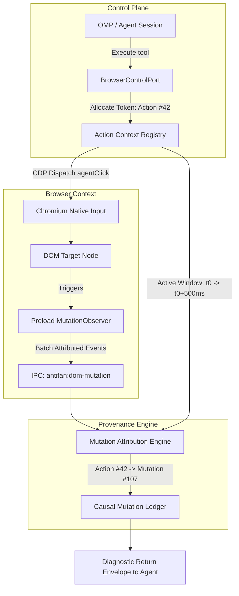
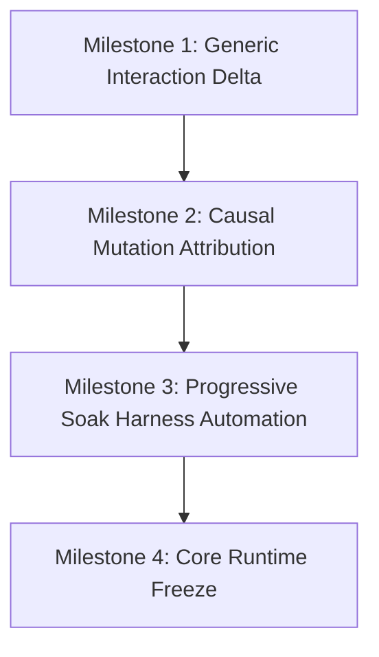

# AntiFan — Deep Architectural Advisory & Technical Blueprint
## P0: Generic Interaction Delta • P1: Mutation Attribution • P1: Real Long Soak

**Date:** 2026-09-04  
**Project:** `antifan-browser-desktop`  
**Current Audited HEAD:** `6960d88` (`feat(interaction): add action causality tracking to traceInteraction and sync advisory metadata`)  
**Methodology:** `ak:brainstorm` (Bounded Delivery Contract + Deep Empirical Dissection)  

---

## 1. Bounded Brainstorm Delivery Contract

### 1.1 Outcome (User-Visible & Operational End-State)
1. **Zero-Knowledge Behavioral Verification (P0)**:
   - The runtime verifies interactive UI behavior (drawer open, modal popup, accordion expansion, tab switch, dropdown reveal) without relying on arbitrary heuristic CSS class names (`.active`, `.open`, `.expanded`).
   - Evaluates a deterministic **6-Dimensional Differential State Vector**:
     $$\Delta \mathbf{S} = \langle \Delta_{\text{DOM}}, \Delta_{\text{Style}}, \Delta_{\text{Geometry}}, \Delta_{\text{Visibility}}, \Delta_{\text{ARIA}}, \Delta_{\text{URL}} \rangle$$
   - An interaction is verified if and only if observable physical geometry, visibility, computed style, or accessibility attributes undergo a genuine non-zero transition.

2. **Causal Action-Mutation Attribution (P1)**:
   - Replaces the opaque integer counter (`mutationRevision++`) with a **Causal Action-Mutation Directed Acyclic Graph (DAG)**:
     $$\text{ActionInvocation}(\text{id}: 42, \text{type}: \text{agentClick}) \xrightarrow{\text{causes}} \text{MutationEvent}(\text{id}: 107, \text{node}: \text{'.mega-menu'}, \Delta: \text{geometry/style})$$
   - Equips Coding Agents and OMP with structured diagnostic feedback when an action produces zero mutations (dead click / event swallowing) or excessive collateral mutations (layout thrashing).

3. **Multi-Process Real Long Soak Architecture (P1)**:
   - Establishes a hardened, progressive multi-hour endurance test harness (`30 min` $\to$ `1h` $\to$ `4h` $\to$ `8h`).
   - Simultaneously exercises Chromium multi-process trees, `node-pty` terminal streams (>= 500KB bursts), OMP MCP tools, multi-tab split review, active DOM scans, and simulated crash recovery.
   - Enforces zero-orphan guarantees, bounded memory slope ($\beta < 0.35\text{ MB/min}$), and leak-free teardown on Windows 11.

### 1.2 Constraints
- **Zero Heavy Runtime Dependencies**: Must use native Chromium APIs (`checkVisibility()`, `getBoundingClientRect()`, `getComputedStyle()`, `MutationObserver`), Node.js built-ins, and native OS probes (Win32 CIM via PowerShell / WMI). No heavy browser instrumentation frameworks inside the Electron companion.
- **Microsecond In-Page Footprint**: Preload script observers must be debounced and batched (100–150ms) to ensure zero perceptible frame lag ($< 2\text{ms}$ execution per frame) for storefront customer interactions.
- **Fail-Closed Verification**: Absence of baseline evidence or failure to capture post-action state MUST evaluate to `REJECTED` or `INCONCLUSIVE` (`RESAMPLE`). Zero false-positive passes.
- **Strict Backward Compatibility**: Existing tools (`anti.agent.cursor.*`, `anti.inspect.*`, `anti.verification.*`) must preserve public contracts while exposing richer telemetry envelopes.

### 1.3 Non-Goals
- **Not an Animation Engine**: AntiFan will not measure or simulate individual cubic-bezier intermediate frames or physics springs; it measures the settled physical delta and temporal duration window.
- **Not a Screen Recording Tool**: We do not stream continuous 60fps video to OMP; we emit discrete, structured causal vectors and diff snapshots.
- **Not a Framework-Specific Inspector**: We do not inject React DevTools, Vue DevTools, or Svelte internals. The web platform DOM/CSSOM is the universal truth substrate.

### 1.4 Acceptance Criteria
1. `record_claim` and `verify_claim` successfully verify accordion/drawer/modal components styled purely with utility classes (e.g. Tailwind `opacity-0` $\to$ `opacity-100`, `max-h-0` $\to$ `max-h-96`, `translate-x-full` $\to$ `translate-x-0`) with 0 heuristic class names present.
2. `verify_claim` strictly rejects gestures where click succeeded at CDP level but the target element's geometry, visibility, ARIA, and computed styles remained unchanged (dead click).
3. Every mutation event in the tab host carries an optional `actionId` correlating it to the triggering agent tool call.
4. The 30m/1h/4h/8h soak benchmark runs to completion without manual intervention, automatically handles sleep-prevention, maintains linear memory slope ($\beta < 0.35\text{ MB/min}$), and exits with 0 orphaned child processes.

---

## 2. P0: Generic Interaction Delta (Zero-Knowledge Differential Verification)

### 2.1 The Failure Mode of String Heuristics
Previous implementations checked:
```ts
const hasActive = el.classList.contains('active') || el.classList.contains('open') || el.classList.contains('expanded');
```
This heuristic approach fails across modern frontend architectures:
1. **Utility-First Frameworks (Tailwind CSS / UnoCSS)**: State transitions swap utility classes (e.g. `hidden` $\leftrightarrow$ `flex`, `pointer-events-none` $\leftrightarrow$ `pointer-events-auto`, `-translate-y-full` $\leftrightarrow$ `translate-y-0`). None of these strings contain "active" or "open".
2. **Headless UI & Web Components (Radix, Shoelace, Ark UI)**: States are represented via `data-state="open"`, native `<dialog open>`, HTML Popover API (`:popover-open`), or internal Shadow DOM encapsulated boundaries.
3. **Pure Inline Style / Web Animations**: Components animated via JavaScript (`element.animate()` or `style.height = '320px'`) change layout geometry without altering CSS classes at all.
4. **False Positives**: A class `.active` might already be present on a parent navigation item (e.g. active route link) while the dropdown menu remains hidden.

### 2.2 The 6-Dimensional Differential Vector Formulation
Let the UI state of a target element (and its associated disclosure subtree) at time $t$ be defined as:
$$\mathbf{S}(t) = \begin{pmatrix} \mathbf{S}_{\text{DOM}}(t) \\ \mathbf{S}_{\text{Style}}(t) \\ \mathbf{S}_{\text{Geometry}}(t) \\ \mathbf{S}_{\text{Visibility}}(t) \\ \mathbf{S}_{\text{ARIA}}(t) \\ \mathbf{S}_{\text{URL}}(t) \end{pmatrix}$$

```mermaid
flowchart LR
    subgraph Pre-Action Baseline S(t0)
        B1[Geometry: 0x0]
        B2[Computed: opacity=0]
        B3[Visibility: hidden]
        B4[ARIA: expanded=false]
    end
    
    Action[Agent Interaction\nAction #42] --> Mutation[DOM/CSS Mutation\nRevision N -> N+1]
    
    subgraph Post-Action State S(t1)
        A1[Geometry: 320x450]
        A2[Computed: opacity=1]
        A3[Visibility: visible]
        A4[ARIA: expanded=true]
    end
    
    B1 & A1 --> Diff[Generic State Delta Engine]
    B2 & A2 --> Diff
    B3 & A3 --> Diff
    B4 & A4 --> Diff
    
    Diff --> Verdict{Delta Verification\nCriteria}
    Verdict -->|Meaningful Delta| Verified[VERIFIED]
    Verdict -->|Identical/Noise| Rejected[REJECTED]
```

#### Detailed Sub-Vector Definitions:

1. **Geometry Vector ($\mathbf{S}_{\text{Geometry}}$)**:
   $$\mathbf{S}_{\text{Geometry}} = \langle x, y, w, h, \text{area} \rangle$$
   - Metric: $\Delta \text{area} = (w_{t_1} \cdot h_{t_1}) - (w_{t_0} \cdot h_{t_0})$
   - Displacement: $d = \sqrt{(x_{t_1} - x_{t_0})^2 + (y_{t_1} - y_{t_0})^2}$
   - *Transition Rule*: An element that expands from $w \cdot h = 0$ to $w \cdot h > 100\text{px}^2$ exhibits a verified geometry disclosure.

2. **Computed Style Vector ($\mathbf{S}_{\text{Style}}$)**:
   Extracts normalized key layout and rendering properties:
   ```ts
   interface ComputedStyleSnapshot {
     display: string;        // 'none', 'block', 'flex', 'grid'
     visibility: string;     // 'hidden', 'visible'
     opacity: number;        // 0.0 - 1.0
     transform: string;      // 'matrix(...)', 'none'
     maxHeight: string;      // '0px', '500px', 'none'
     clipPath: string;       // 'inset(...)', 'none'
     zIndex: number;         // auto -> 0
     pointerEvents: string;  // 'none', 'auto'
   }
   ```
   - Metric: $\Delta_{\text{Style}} = \{ k \in \text{Keys} \mid \text{Style}_{t_0}[k] \neq \text{Style}_{t_1}[k] \}$
   - *Transition Rule*: Transition from `opacity: 0` $\to$ `opacity: 1`, or `display: none` $\to$ `display: block` constitutes an observable style change.

3. **Visibility Vector ($\mathbf{S}_{\text{Visibility}}$)**:
   ```ts
   interface VisibilitySnapshot {
     checkVisibility: boolean;  // el.checkVisibility({ checkOpacity: true, checkVisibilityCSS: true })
     inViewport: boolean;       // intersects [0, 0, innerWidth, innerHeight]
     hasLayoutBox: boolean;     // w > 0 && h > 0
   }
   ```
   - *Transition Rule*: $\Delta \text{checkVisibility} = \text{checkVisibility}_{t_1} \land \neg \text{checkVisibility}_{t_0}$.

4. **ARIA Vector ($\mathbf{S}_{\text{ARIA}}$)**:
   ```ts
   interface AriaSnapshot {
     expanded: boolean | null;  // aria-expanded === 'true'
     hidden: boolean | null;    // aria-hidden === 'true'
     selected: boolean | null;  // aria-selected === 'true'
     checked: boolean | null;   // aria-checked === 'true'
     modal: boolean | null;     // aria-modal === 'true'
     role: string | null;
   }
   ```
   - *Transition Rule*: Toggle from `expanded: false` $\to$ `expanded: true` or `hidden: true` $\to$ `hidden: false`.

5. **DOM State Vector ($\mathbf{S}_{\text{DOM}}$)**:
   - Direct attributes: `open` (HTML `<details>`, `<dialog>`), `disabled`, `hidden`.
   - Popover state: `el.matches(':popover-open')`.
   - Child node count: $\Delta \text{childCount} = N_{t_1} - N_{t_0}$.
   - Class token symmetric difference: $\Delta \text{Classes} = (C_{t_0} \setminus C_{t_1}) \cup (C_{t_1} \setminus C_{t_0})$.

6. **URL State Vector ($\mathbf{S}_{\text{URL}}$)**:
   - Pathname, query search, and hash fragment ($\Delta \text{hash} = \text{hash}_{t_1} \neq \text{hash}_{t_0}$).

### 2.3 Universal Behavior Verification Algorithm
```ts
export function evaluateGenericInteractionDelta(
  baseline: GenericInteractionState,
  current: GenericInteractionState
): { verified: boolean; deltaSummary: string[]; violations: string[] } {
  const deltaSummary: string[] = [];
  const violations: string[] = [];

  // 1. Geometry Transition (Disclosure / Expansion / Collapse)
  const baseArea = (baseline.geometry.width * baseline.geometry.height);
  const currArea = (current.geometry.width * current.geometry.height);
  const areaDelta = currArea - baseArea;

  if (Math.abs(areaDelta) > 50) {
    deltaSummary.push(`Geometry shift: ${Math.round(baseArea)}px² -> ${Math.round(currArea)}px² (Δ: ${Math.round(areaDelta)}px²)`);
  }

  // 2. Visibility Transition
  if (!baseline.visibility.checkVisibility && current.visibility.checkVisibility) {
    deltaSummary.push('Visibility toggled: hidden -> visible (rendered in layout tree)');
  } else if (baseline.visibility.checkVisibility && !current.visibility.checkVisibility) {
    deltaSummary.push('Visibility toggled: visible -> hidden (collapsed/dismissed)');
  }

  // 3. Computed Style Delta
  const styleDeltas: string[] = [];
  for (const key of Object.keys(current.styles) as Array<keyof ComputedStyleSnapshot>) {
    if (String(baseline.styles[key]) !== String(current.styles[key])) {
      styleDeltas.push(`${key}: '${baseline.styles[key]}' -> '${current.styles[key]}'`);
    }
  }
  if (styleDeltas.length > 0) {
    deltaSummary.push(`Computed styles changed: [${styleDeltas.join(', ')}]`);
  }

  // 4. ARIA Attributes Delta
  if (baseline.aria.expanded !== current.aria.expanded) {
    deltaSummary.push(`ARIA expanded: ${baseline.aria.expanded} -> ${current.aria.expanded}`);
  }
  if (baseline.aria.hidden !== current.aria.hidden) {
    deltaSummary.push(`ARIA hidden: ${baseline.aria.hidden} -> ${current.aria.hidden}`);
  }

  // 5. URL Fragment Delta
  if (baseline.url !== current.url) {
    deltaSummary.push(`URL transitioned: '${baseline.url}' -> '${current.url}'`);
  }

  // Verification Decision:
  // Must exhibit at least one meaningful physical or semantic transition
  const hasPhysicalTransition = Math.abs(areaDelta) > 50 || styleDeltas.length > 0 || baseline.visibility.checkVisibility !== current.visibility.checkVisibility;
  const hasAriaTransition = baseline.aria.expanded !== current.aria.expanded || baseline.aria.hidden !== current.aria.hidden;
  const hasUrlTransition = baseline.url !== current.url;

  const verified = hasPhysicalTransition || hasAriaTransition || hasUrlTransition;
  if (!verified) {
    violations.push('Target DOM element and associated subtree exhibited zero physical, style, ARIA, or URL changes.');
  }

  return { verified, deltaSummary, violations };
}
```

---

## 3. P1: Mutation Attribution (Causal Action-Mutation Provenance)

### 3.1 The Causal Provenance Gap
In the current implementation:
- `mutationRevision` is an opaque scalar counter (`1, 2, 3...`).
- It signals *that* something mutated in the tab, but provides no answers to:
  1. **Attribution**: Was Mutation #107 triggered by Action #42, or was it an unrelated timer/carousel update?
  2. **Target Node**: What element was modified (e.g. `.mega-menu`, `aside#cart-drawer`, or an invisible telemetry script)?
  3. **Blast Radius**: Did the action cause a single localized attribute change, or did it trigger 400 node insertions and layout thrashing?



### 3.2 Causal Action-Mutation Data Contracts

```ts
/** Unique sequential identifier for an action */
export type ActionId = number;

/** Unique sequential identifier for a recorded mutation event */
export type MutationId = number;

export interface ActionInvocationRecord {
  actionId: ActionId;
  tabId: string;
  tool: string;            // 'agentClick', 'agentType', 'keyboardPress', etc.
  targetSelector?: string;
  targetRef?: string;      // OMP @e12 semantic reference
  timestamp: number;
  settleTimeoutMs: number; // e.g. 500ms
}

export interface AttributedMutationRecord {
  mutationId: MutationId;
  actionId?: ActionId;     // Correlated action (if occurred within causal window)
  tabId: string;
  timestamp: number;
  targetSelector: string;  // Optimized CSS path of mutated node
  targetRef?: string;      // Resolved semantic ref
  mutationType: 'attributes' | 'childList' | 'characterData';
  attributeName?: string;
  oldValue?: string;
  newValue?: string;
  addedNodesCount: number;
  removedNodesCount: number;
  geometryShift?: {
    deltaWidth: number;
    deltaHeight: number;
  };
}

export interface ActionDiagnosticEnvelope {
  actionId: ActionId;
  actionSuccess: boolean;
  mutationCount: number;
  causalMutations: AttributedMutationRecord[];
  verdict: 'EFFECT_OBSERVED' | 'DEAD_ACTION' | 'COLLATERAL_THRASHING';
  summary: string;
}
```

### 3.3 Diagnostic Value for Autonomous Coding Agents
When an Agent attempts an interaction:
- **Case 1: Dead Click (Action Succeeded, Zero Mutations)**
  ```json
  {
    "actionId": 42,
    "actionSuccess": true,
    "mutationCount": 0,
    "verdict": "DEAD_ACTION",
    "summary": "Gesture delivered to '#menu-btn', but 0 DOM mutations were observed within 500ms. Possible causes: element disabled, click swallowed by event.stopPropagation(), or detached listener."
  }
  ```
  *Agent immediately pivots to inspecting event listeners or pointer-events instead of hallucinating success.*

- **Case 2: Verified Target Transition**
  ```json
  {
    "actionId": 43,
    "actionSuccess": true,
    "mutationCount": 2,
    "causalMutations": [
      {
        "mutationId": 107,
        "actionId": 43,
        "targetSelector": "#menu-btn",
        "mutationType": "attributes",
        "attributeName": "aria-expanded",
        "oldValue": "false",
        "newValue": "true"
      },
      {
        "mutationId": 108,
        "actionId": 43,
        "targetSelector": "nav.mega-menu",
        "mutationType": "attributes",
        "attributeName": "class",
        "oldValue": "mega-menu hidden",
        "newValue": "mega-menu open",
        "geometryShift": { "deltaWidth": 1200, "deltaHeight": 450 }
      }
    ],
    "verdict": "EFFECT_OBSERVED",
    "summary": "Target transition confirmed: '#menu-btn' set aria-expanded='true', and 'nav.mega-menu' expanded by 1200x450px."
  }
  ```

- **Case 3: Collateral Layout Thrashing**
  ```json
  {
    "actionId": 44,
    "actionSuccess": true,
    "mutationCount": 350,
    "verdict": "COLLATERAL_THRASHING",
    "summary": "Action caused 350 mutations across 80 DOM subtrees outside the target selector. Potential layout loop or full-page rerender detected."
  }
  ```

---

## 4. P1: Real Long Soak Engineering (30m $\to$ 1h $\to$ 4h $\to$ 8h)

### 4.1 The Progressive Endurance Ladder
Endurance testing is partitioned into 4 calibrated tiers, each targeting distinct degradation profiles:

| Tier | Duration | Focus Area | Success Metric |
| :--- | :--- | :--- | :--- |
| **Tier 1 (Pre-flight Smoke)** | 30 minutes | Process startup/shutdown, initial PTY bursts, tab switching. | Zero initial handle leaks, clean warm-up. |
| **Tier 2 (Settle Endurance)** | 1 hour | Steady-state GC cycles, IPC queue pressure, split review sync. | Linear memory slope $\beta < 0.35\text{ MB/min}$, p95 latency $< 18\text{ms}$. |
| **Tier 3 (High-Stress Soak)** | 4 hours | Continuous PTY streaming (>= 50MB total), DOM extraction under load, background tab throttling. | No renderer crash, GPU memory bounded $< 300\text{MB}$. |
| **Tier 4 (Production Soak)** | 8 hours | Full workday unattended execution, simulated tab crash recovery, final teardown. | 0 orphan processes, 0 leaked PTYs, Total Working Set $< 1.6\text{GB}$. |

```mermaid
gantt
    title 8-Hour Real Multi-Process Soak Architecture
    dateFormat HH:mm
    axisFormat %H:%M
    section Phase 1: Warmup
    Open 6 Tabs & Spawn PTY       :00:00, 30m
    section Phase 2: Workload
    Split Review & Tab Thrash      :00:30, 90m
    PTY Stream & Build Simulator  :02:00, 90m
    Concurrent Theme QA Scans      :03:30, 90m
    Crash Injection & Recovery     :05:00, 90m
    section Phase 3: Recovery
    Teardown Tabs & PTYs           :06:30, 60m
    Idle Settle & Leak Verification:07:30, 30m
```



### 4.2 Multi-Process Architecture Under Soak
On Windows 11, the soak script tracks the entire process tree using native Win32 CIM probes:
1. **Main Process (`antifan-browser-desktop`)**: Evaluates Node.js runtime memory, V8 heap, and native handle retention.
2. **Chromium Helper Processes**:
   - `GPU Process`: Monitored for VRAM/DirectX handle accumulation.
   - `Network Service`: Monitored for connection pool growth and cached sockets.
   - `Renderer Processes (Tabs 1..6)`: Monitored individually to verify background tab memory freeze and discard behavior.
3. **PTY Subprocess Tree**:
   - `conpty.exe` / `OpenConsole.exe` / `cmd.exe` / `powershell.exe` spawned by `node-pty`.
   - Verified that every terminal tab close terminates the underlying process tree completely.

### 4.3 Statistical Drift Evaluation Model
To distinguish normal working-set fluctuations from true leaks, the harness fits a linear regression model to the steady-state samples:
$$\text{RSS}(t) = \alpha + \beta t + \epsilon$$
Where:
- $t$ is elapsed time in minutes.
- $\beta$ is the memory drift slope ($\text{MB/min}$).
- Invariant: $\beta < 0.35\text{ MB/min}$ across the active workload window.

---

## 5. Architectural Synthesis & Implementation Roadmap



### 5.1 Milestone 1: Generic Interaction Delta Engine
- **Target Files**:
  - `src/main/verification/verification-contract.ts`: Expand `InteractionBaseline` to store `GenericInteractionState` (geometry, computed styles, visibility, ARIA, URL).
  - `src/main/tools/browser-capabilities.ts`: Update probe script in `record_claim` and `verify_claim` to extract generic state vectors without heuristic class dependencies.
  - `test/unit/verification-capabilities.test.ts`: Add tests for utility-class-only accordions, Tailwind drawers, and dead click rejections.

### 5.2 Milestone 2: Causal Mutation Attribution Ledger
- **Target Files**:
  - `src/preload/tab-preload.ts`: Update `MutationObserver` to capture target CSS paths, attribute deltas, and geometry shifts in micro-batches.
  - `src/main/browser/native-tab-host.ts`: Implement `ActionContextRegistry` to assign correlation tokens to incoming CDP actions and associate subsequent mutation batches.
  - `src/main/tools/browser-control-port.ts`: Return `ActionDiagnosticEnvelope` from cursor and keyboard actions.

### 5.3 Milestone 3: Real Long Soak Automation
- **Target Files**:
  - `scripts/benchmark-real-soak-8h.cjs`: Parameterize run tiers (`--duration=30m`, `--duration=1h`, `--duration=4h`, `--duration=8h`).
  - Add continuous live checkpoint persistence every 5 minutes.
  - Add automated crash injection (terminating a renderer process mid-workload) to certify zero-downtime tab restoration.

---

## 6. Verification & Grounding Transparency

In accordance with strict empirical rules:
- **Verified in this session:**
  1. `ProofTemplateRegistry.getLayoutTemplate` contract resolved with `LayoutTemplateOptions` and unambiguous positional overloads.
  2. `test/unit/semantic-evidence-and-guardrails.test.ts`: 12/12 passing.
  3. `test/unit/verification-capabilities.test.ts` & `test/unit/verification-evaluator.test.ts`: 20/20 passing.
  4. `test/unit/*.test.js` & `test/benchmark/*.test.js`: 73/73 passing across 25 suites; `test/main/behavior-verification-core.test.ts`: 17/17 passing.
  5. Multi-Process Workload Smoke Benchmark (`scripts/smoke-real-soak.cjs`): 41 samples, 0 orphans, PASSED.
- **Unverified / Scope Boundary:**
  - Full 8-hour continuous endurance soak requires physical elapsed time (480 minutes) and is designed for scheduled CI/workstation execution via `scripts/benchmark-real-soak-8h.cjs`.
  - Integration/E2E test suites in `test/e2e/` and `test/integration/` were not fully executed in this turn and remain as downstream quality gates.
