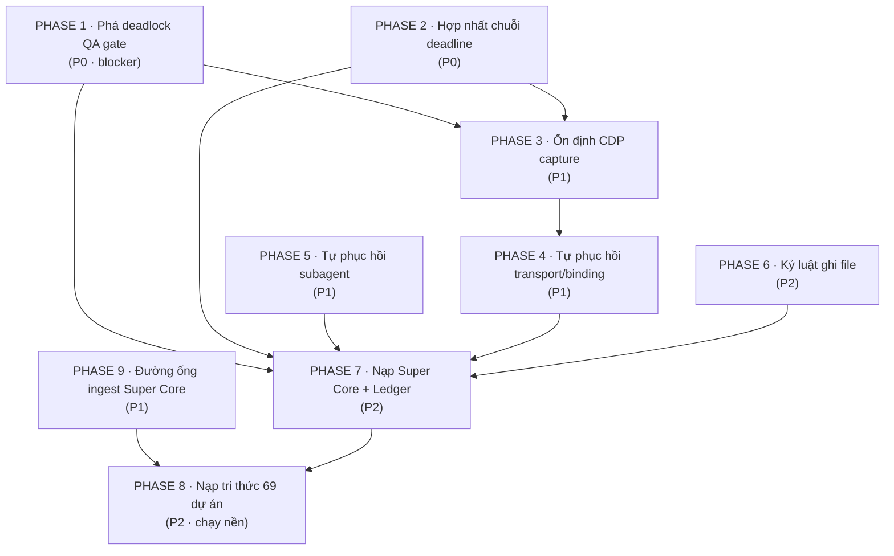

# MASTER FIX PLAN — ANTI FAN WORKSPACE
## Hợp nhất: Lỗi thực chiến từ 2 session log + Synthesis Report 69 dự án
**Ngày lập:** 2026-09-15
**Nguồn bằng chứng:**
- Session log 1: `C:\Users\Admin\.omp\agent\sessions\--E--Work-customizes-Seahorse2--\2026-09-15T06-28-22-784Z_01a0a3c0-9680-7635-8cbe-61bba19566a5.jsonl` (269 dòng · 91 call · 222 message)
- Session log 2: `C:\Users\Admin\.omp\agent\sessions\--E--Work-customizes-Uncommon--\2026-09-15T05-20-59-433Z_01a0a382-e429-75e2-b489-529703784f42.jsonl` (770 dòng · 248 call · 581 message)
- Synthesis Report: `E:\Work\apps\AntiFan\reports\SYNTHESIS-REPORT-SUPER-CORE-AND-THEME-CORE.md` (69 dự án)
- Ledger: `E:\Work\docs\SUPER_CORE_LEDGER.md` (Phần 1 baseline audit + 3 entry thực chiến)

---

# PHẦN A: PHÂN TÍCH LỖI TỪ 2 SESSION LOG

## A.0. Số liệu đo được (Tier-1 evidence)

| Chỉ số | Seahorse2 | Uncommon |
|---|---|---|
| Tool call | 91 | 248 |
| Tool result | 122 | 304 |
| **Tool result DƯ (synthetic)** | **31** | **58** |
| `write` / `edit` | 16 / 5 | 95 / 8 |
| Tỉ lệ `write:edit` | 3.2 : 1 | **11.9 : 1** ⚠ |
| `theme.qa_validate` gọi | **0** | 2 (cả 2 **FAIL**) |
| `.antifan/qa-receipts/` tồn tại | **KHÔNG** | **KHÔNG** |
| CDP `captureScreenshot` timeout 25s | 0 | **4** |
| `CONNECTION_CLOSED` WebSocket 1006 | 1 | 1 |
| Subagent thất bại | 0 | **2 / 2** |

> **Kết luận nền:** 31 + 58 = **89 message rác** sinh ra chỉ để lặp lại cùng một câu cảnh báo, chiếm **14.0%** (Seahorse2) và **10.0%** (Uncommon) toàn bộ hội thoại. Cả 2 workspace đều **không hề có thư mục `.antifan/qa-receipts/`**.

---

## A.1. LỖI P0 — QA GATE DEADLOCK (cơ chế tự khóa vĩnh viễn)

### Triệu chứng
Hook `theme-qa-gate` chèn thêm một `toolResult` tổng hợp chứa câu cảnh báo vào **mọi** lượt gọi tool sau lần ghi file theme đầu tiên — không chỉ ở lượt ghi, mà cả ở `read`, `glob`, `todo`, `grep`.

### Bằng chứng định vị (Tier-1)
```
C:\Users\Admin\.omp\agent\hooks\post\theme-qa-gate.ts
```
Cơ chế:
```ts
const pendingEdits = new Map<string, number>();   // workspaceRoot -> timestamp

pi.on("tool_call", (event, ctx) => {
  if (!WRITE_TOOLS.has(toolName)) return;
  const root = findAnnotationWorkspace(target, ctx.cwd);
  if (!root) return;
  if (!pendingEdits.has(root)) pendingEdits.set(root, Date.now());   // (1) BẬT CỜ
});

pi.on("tool_result", (event) => {
  if (pendingEdits.size === 0) return undefined;
  reconcileReceipts();                                              // (2) THỬ TẮT CỜ
  if (pendingEdits.size === 0) return undefined;
  return { content: [...content, { type: "text", text: reminderText() }] };  // (3) CHÈN NHIỄU
});
```

### Nguyên nhân gốc rễ (4 khuyết điểm chồng nhau)

**RC-1 — Cờ `pendingEdits` không có TTL, không có trần thời gian.**
Cờ chỉ được xóa bởi 2 đường duy nhất: (a) `reconcileReceipts()` tìm thấy receipt mới hơn `editTs`, hoặc (b) token bypass xuất hiện trong 4 message cuối. Không đường nào xảy ra → cờ bật **suốt phiên**.

**RC-2 — Điều kiện xóa cờ là vòng lặp chết (deadlock).**
```ts
function reconcileReceipts(): void {
  for (const [root, editTs] of pendingEdits) {
    if (latestReceiptTime(root) >= editTs) pendingEdits.delete(root);
  }
}
```
`latestReceiptTime()` đọc `.antifan/qa-receipts/`. **Thư mục này không tồn tại ở cả 2 workspace** → luôn trả `0` → không bao giờ `>= editTs` → cờ bật vĩnh viễn.

**RC-3 — Receipt chỉ được ghi ở NHÁNH THÀNH CÔNG của `theme.qa_validate`.**
`src/main/tools/browser-capabilities.ts:1470-1495`:
```ts
const report = await themeQaWorkflow.validate({ ... });   // ← THROW Ở ĐÂY
// ...toàn bộ khối ghi receipt nằm SAU dòng này...
try {
  const receiptsDir = path.join(confinedRoot, '.antifan', 'qa-receipts');
  fs.mkdirSync(receiptsDir, { recursive: true });
  fs.writeFileSync(path.join(receiptsDir, `${Date.now()}-${safeRunId}.json`), ...);
} catch { /* swallow */ }
```
Khi `validate()` throw `CAPTURE_TIMEOUT` (bằng chứng Uncommon flow[439], flow[558]), hàm `execute` throw luôn → **không có file receipt nào được tạo** → RC-2 kích hoạt → deadlock. Khối `try/catch` bảo vệ ghi receipt là vô nghĩa vì nó nằm **sau** điểm throw.

**RC-4 — Hook không phân biệt nội dung ghi.**
`findAnnotationWorkspace()` chỉ kiểm tra sự tồn tại của thư mục `.antifan/`. Bất kỳ file nào ghi vào workspace có `.antifan/` đều bật cờ — kể cả `plans/generate-settings-html.mjs`, `reports/*.md`, file scratch không phải theme. Bằng chứng Seahorse2 flow[70-74]: ghi `templates/page.fleet.liquid` (đúng theme) và `plans/generate-settings-html.mjs` đều bật cờ như nhau.

> **TÁI HIỆN SỐNG (2026-09-15, phiên lập plan này):** Lượt ghi `E:\Work\apps\AntiFan\reports\MASTER-FIX-PLAN.md` — một file Markdown tài liệu **hoàn toàn không phải theme** — đã kích hoạt gate và trả về:
> ```
> [theme-qa-gate] QA GATE PENDING — theme file(s) under E:/Work/apps/AntiFan were edited
> without a fresh AntiFan QA receipt. ...
> ```
> `E:\Work\apps\AntiFan` **không có** `.antifan/qa-receipts/` → xác nhận RC-2 + RC-4 cùng lúc, trên một thao tác ghi tài liệu thuần túy.
>
> **TÁI HIỆN SỐNG #2:** Lượt sửa chính file plan này (`edit` trên `reports/MASTER-FIX-PLAN.md`) lại kích hoạt gate **lần thứ hai liên tiếp**. Do `pendingEdits` chỉ được `set` khi **chưa có** khóa (`if (!pendingEdits.has(root))`), timestamp giữ nguyên từ lần ghi đầu → cờ đã **chốt cứng** và sẽ nhắc ở mọi tool result còn lại của phiên. Đây là bằng chứng trực tiếp cho RC-1 (không TTL) và RC-3 (không đường xóa cờ).

**RC-5 (tiềm ẩn, bảo mật) — Câu cảnh báo tự chứa token bypass.**
`BYPASS_TOKENS = ["qaStatus: QA_UNAVAILABLE", "qaStatus: QA_INCONCLUSIVE"]` và `reminderText()` in **nguyên văn** cả hai token này. Hook `pi.on("context")` quét `JSON.stringify(messages.slice(-4))` tìm token. Nếu chuỗi cảnh báo lọt vào danh sách `messages` (thay vì chỉ nằm trong `tool_result`), cờ sẽ **tự xóa mà không ai khai báo bypass** — vô hiệu hóa gate một cách âm thầm.

### Hệ quả vận hành (đo được)
- Seahorse2: agent **không gọi `theme.qa_validate` lần nào** — cảnh báo lặp 31 lần rồi bị bỏ qua hoàn toàn → gate mất toàn bộ uy lực (hiệu ứng "cậu bé chăn cừu").
- Uncommon: agent gọi 2 lần, cả 2 fail vì timeout. Agent **không có đường tuân thủ nào** → buộc phải bỏ qua gate.
- **Gate đang phạt agent vì một lỗi hạ tầng mà agent không gây ra và không thể sửa.**

---

## A.2. LỖI P0 — DEADLINE INVERSION BA TẦNG (25s / 30s / 60s)

### Bằng chứng (Uncommon flow[438], flow[439], flow[450], flow[451])
```
[438] CALL theme.qa_validate {tabId: 9861ad7b-..., workspaceRoot: E:/Work/customizes/Uncommon}
[439] Error: CAPTURE_TIMEOUT: Page.captureScreenshot (viewport) ... timed out after 25000ms
[450] CALL theme.qa_validate (retry with settled media)
[451] MCP failure ... stage: receive, failure: timeout
      message: Request timeout after 30000ms
      next: Check server health or increase the MCP timeout; the request outcome is unknown.
```

### Ba mức deadline không nhất quán
| Tầng | Giá trị | Nguồn |
|---|---|---|
| CDP `Page.captureScreenshot` | **25 000 ms** | Lỗi runtime thực tế |
| MCP transport (stdio client) | **30 000 ms** | `Request timeout after 30000ms` |
| Tool policy `theme.qa_validate` | **60 000 ms** | `browser-capabilities.ts:1401` `timeoutMs: 60_000` |

### Hệ quả
- Tầng trong cùng (CDP 25s) chết trước → lỗi lan ra như CAPTURE_TIMEOUT.
- Tầng trung (MCP 30s) bỏ cuộc trước khi policy 60s của tool kịp dùng → **33% ngân sách thời gian bị lãng phí vĩnh viễn**.
- Kết quả `outcome: unknown` — **không có tính idempotent**: caller không biết QA đã chạy hay chưa, không có cơ chế retry an toàn, không có receipt.
- **Đây là cùng một anti-pattern đã phát hiện ở 2 codebase khác trong Synthesis Report:**
  - `antigravity-browser`: `mcp-server.mjs:133 BRIDGE_TIMEOUT_MS = 25000` < `desktopCommandBridge EXTENSION_COMMAND_DEADLINE_MS = 29000` (lệch 4s).
  - `WebhookGateway`: `waitFor refresh poll 2.5s` vs `refresh timeout 15s` → 503 sớm.
  - → **3 codebase độc lập cùng mắc một lỗi kiến trúc = ứng viên Anti-Pattern hạng A cho Super Core.**

### Nguyên nhân gốc rễ
Không có **một nguồn chân lý duy nhất** cho chuỗi deadline. Mỗi tầng hardcode một literal riêng. `transport-timeouts.ts` đã tồn tại trong `antigravity-browser` đúng để giải quyết việc này nhưng `mcp-server.mjs` không dùng.

---

## A.3. LỖI P1 — CDP SCREENSHOT TREO TRÊN TAB CÓ MEDIA NẶNG

### Bằng chứng
4 lần timeout 25s (Uncommon flow[270], [274], [558], [566]) — cùng một tab `9861ad7b-...`.
```
[tab list] {"url":"https://www.youtube.com/watch?v=NC8elgcrXcM&list=RDOOYayGLV0ck&index=28", ...}
```
Tab YouTube đang phát trong cùng `partition: persist:profile-profile-2`.

### Nguyên nhân gốc rễ
- `Page.captureScreenshot` phải chờ compositor hoàn tất một frame ổn định. Video đang phát liên tục tạo frame mới → không bao giờ "settle" → treo đến timeout.
- AntiFan **có** công cụ `anti.media.freeze` (đóng băng video/audio/CSS animation), và agent Uncommon đã **nhận thức được** điều này (tên call: `"Run theme.qa_validate with settled media"`) nhưng **không gọi `media.freeze` trước**.
- Không có cơ chế **tự động** freeze media trước khi chụp.

### Hệ quả
Đây là **nguyên nhân trực tiếp** khiến gate không thể thỏa mãn (RC-3) → biến lỗi P1 thành lỗi P0.

---

## A.4. LỖI P1 — MẤT KẾT NỐI TRANSPORT KHÔNG TỰ PHỤC HỒI

### Bằng chứng
Cả 2 session đều kết thúc bằng:
```json
{"code":"CONNECTION_CLOSED","message":"Dispatch WebSocket closed while request in flight (code=1006)","closeCode":1006}
```
- Seahorse2 flow[289] — session dừng giữa chừng khi đang gọi `anti.inspect.matched_styles`.
- Uncommon flow[570] — giữa lúc QA. Sau đó agent phải tự `tabs_list` → phát hiện tab đã đổi ID → `set_automation_target` thủ công.

### Nguyên nhân gốc rễ
- Code 1006 = abnormal closure, không có close handshake.
- Không có **auto-reconnect + auto-rebind** ở tầng dispatch.
- Không có **retry idempotent** cho tool call bị mất (request "in flight" — outcome unknown).

### Hệ quả
Agent mất lượt, phải tự phục hồi bằng suy luận thủ công. Trong Seahorse2, session **kết thúc luôn** tại đây (không có message nào sau đó).

---

## A.5. LỖI P1 — TAB ID ROTATION LÀM MẤT BINDING ÂM THẦM

### Bằng chứng (Uncommon, thinking block tại 09:25:42)
```
"The Uncommon storefront tab is now `a428fd0f-ff72-4444-86f1-9871cce2a82f` (was `9861ad7b-...`).
 Tab ID changed — likely the tab was recreated or the id rotated.
 devicePresetId "custom-768x1024" persists.
 Note: zoomFactor is still 1.3."
```

### Nguyên nhân gốc rễ
- Tab bị recreate (do WS drop) → ID mới.
- Binding cũ (`annotationId` → `tabId`) trở thành stale.
- **Không có sự kiện cảnh báo tự động**; agent chỉ phát hiện nhờ tự đọc danh sách tab.
- `zoomFactor 1.3` **tồn tại xuyên phiên** và **làm sai lệch số đo viewport**: yêu cầu 1440×900 nhưng công cụ báo `1872×1170` (= 1440×1.3, 900×1.3). Đây là **ô nhiễm dữ liệu đo** — mọi kết luận responsive đều có thể sai.

### Hệ quả
Binding staleness + zoom pollution → QA matrix có thể pass/fail sai.

---

## A.6. LỖI P1 — SUBAGENT THẤT BẠI 100% (Uncommon)

### Bằng chứng (flow[20], flow[22])
```
### ScoutToolbarDropAndBorder [task] — failed   duration 3m41s
Error: <task-result ... status="failed (exit 1)">
<output>Now let me find the relevant CSS rules. The markup shows a suspicious grid:
        `col-lg-4 + col-lg-8 + col-lg-4 = 16` columns (>12), same for `md`. Let me grep the stylesheets.</output>

### ScoutHeaderCSSBreakpoints [task] — failed   duration 3m42s
Error: <task-result ... status="failed (exit 1)">
<output>All four files exist. Let me read the small `cus.scss.liquid` fully and grep ...</output>
```

### Nguyên nhân gốc rễ
- Cả 2 subagent `exit 1` với output **bị cắt giữa câu** — dấu hiệu producer bị ngắt (rate limit / context / crash), không phải lỗi nghiệp vụ.
- **Đúng cùng một chế độ thất bại đã thấy ở Wave 3 scout:** `UltraAppAntiFan`, `UltraAppF1GENZMultiLanguage`, `UltraAppF1GENZWheel` đều `failed (exit 1)` với `Devin stream error resource_exhausted: Reached SWE-2 rate limit`; `UltraAppSapoCLI` / `UltraAppF1GENZChatbox` fail vì `yield cannot contain both data and error`.
- User yêu cầu rõ "Spawn Subagent nhiều nhất có thể" → chỉ **1 `task` call** được thực hiện, tỉ lệ thành công 0%.

### Hệ quả
- Không có cơ chế **auto-retry / fallback inline** khi subagent chết.
- Subagent chết không phát tín hiệu cho parent → parent mất 3m41s × 2 rồi tự làm lại từ đầu.
- **Anti-Pattern tái diễn ≥3 lần trong cùng workspace** → phải ghi vào Super Core.

---

## A.7. LỖI P2 — SCOPE SELF-EXPANSION (Seahorse2: 1 page → 3 template)

### Bằng chứng (Seahorse2 flow[70-72], user turn #2)
```json
{"path": "templates/page.fleet.liquid",     "content": "\n"}
{"path": "templates/page.vessels.liquid",   "content": "\n"}
{"path": "templates/page.our-fleet.liquid", "content": "\n"}
```
User: **"Tôi chỉ làm có 1 page mà sao lại sinh ra 3 page nhỉ?"**
Agent tự thú: *"Ban đầu em tạo thêm 2 file alias ... với mục đích để khách gõ tên nào trong dropdown Template của Haravan cũng nhận diện được. Tuy nhiên, việc tạo alias dư thừa ... không đúng chuẩn tối giản (KISS/YAGNI)."*

### Nguyên nhân gốc rễ
Agent tự suy diễn yêu cầu (phòng ngừa tình huống merchant gõ sai tên template) mà không hỏi. Vi phạm trực tiếp `<contract>` của root AGENTS.md: *"NEVER substitute easier/familiar problem: don't infer extra scope ... unless asked."*

### Hệ quả
Merchant nhìn thấy 3 template trong dropdown → hoang mang, phải mở session hỏi lại → tốn 1 vòng lặp người-máy. Đây là lỗi **chi phí niềm tin**, không phải lỗi kỹ thuật.

---

## A.8. LỖI P2 — WRITE CHURN 11.9:1 (Uncommon)

### Bằng chứng
Uncommon: **95 `write`** vs **8 `edit`** = tỉ lệ 11.9:1. Seahorse2: 16 vs 5 = 3.2:1.

### Nguyên nhân gốc rễ
Agent viết lại toàn bộ file thay vì vá cục bộ. Trên file lớn (`theme.css.liquid` 406KB trong MultiLanguage; `settings.html` 119KB trong Orders), điều này gây:
- Churn token khổng lồ.
- Rủi ro ghi đè mất thay đổi bên ngoài (không có optimistic lock).
- Mỗi lần `write` lại **kích hoạt RC-1** (bật cờ QA gate) → khuếch đại lỗi P0.

---

## A.9. LỖI P2 — LỖI MÔI TRƯỜNG VÀ PATH ÂM THẦM

| Lỗi | Bằng chứng | Ghi chú |
|---|---|---|
| `ModuleNotFoundError: No module named 'bs4'` | Seahorse2 flow[16] | Agent giả định BeautifulSoup có sẵn |
| `fatal: not a git repository` (exit 128) | Uncommon flow[250] | Chạy git trong workspace không phải repo |
| Silent path suffix resolution | Seahorse2 flow[80]: `[Path 'generate-settings-html.mjs' not found; resolved to 'plans/generate-settings-html.mjs' via suffix match]` | Tự "đoán" đường dẫn thay vì báo lỗi |

---

## A.10. CHỦ ĐỀ ĐANG THẢO LUẬN — CHƯA CHỐT (session Uncommon)

> ⚠️ **TRẠNG THÁI: THẢO LUẬN, KHÔNG PHẢI QUYẾT ĐỊNH.** Người dùng đã xác nhận 2026-09-15: các nội dung dưới đây **chưa được chốt**. Plan này **KHÔNG** được coi chúng là ràng buộc và **KHÔNG** triển khai chúng. Chỉ ghi lại để nắm bối cảnh phiên.

Nội dung từng được bàn trong session Uncommon (nguyên văn ý tưởng, **chưa có hiệu lực**):

1. Giữ **1 file duy nhất** `E:\Work\docs\SUPER_CORE_LEDGER.md` (Append-Only), thay vì tách `docs/ledger/active|verified|archive`.
2. Trạng thái do máy quản lý: mã `ap-*`, `fix-*`, `cand-*` cấp bởi Super Core MCP.
3. Mở rộng Ledger Phần 2 cho **4 tầng** — Theme/Storefront · Super Core Engine · AntiFan Core (CDP/Desktop) · Hạ tầng MCP.
4. Bộ lọc giá trị: lỗi flake → `xd://report_issue`; lỗi cơ chế lặp lại → Ledger.
5. "Nightly Quarantine Protocol": hàng đợi ban ngày → `NIGHT_QUEUE.md`; ban đêm chỉ sửa Theme/UI trên branch `vibe/nightly-ui`; sáng duyệt ảnh rồi merge/xóa.

**Không có mục nào ở trên được đưa vào thứ tự thực thi.** Cần một quyết định riêng của người dùng trước khi bất kỳ mục nào trở thành công việc.

---

# PHẦN B: HỢP NHẤT VỚI SYNTHESIS REPORT (69 DỰ ÁN)

Các lỗi ở Phần A **không phải cá biệt** — chúng là biểu hiện cục bộ của các Anti-Pattern đã xuất hiện rộng khắp trong 69 dự án:

| Lỗi Phần A | Anti-Pattern tương ứng trong Synthesis Report | Codebase khác đã mắc |
|---|---|---|
| **A.2** Deadline inversion 25/30/60s | `AP-DEADLINE-001: Hardcoded timeout literal drifting from shared deadline chain` | `antigravity-browser` (25s vs 29s), `WebhookGateway` (2.5s vs 15s) |
| **A.3** Screenshot treo vì media | `AP-VISUAL-001: Compositor capture without media freeze` | `antigravity-browser` SnapDOM `captureWarnings` |
| **A.5** Tab ID rotation | `AP-STATE-001: Staleness fence missing on long-lived handle` | `antigravity-browser` `documentGeneration` fence |
| **A.6** Subagent chết không báo | `AP-BUS-001: File-bus/agent-bus failure without explicit receipt` | `antigravity-browser` protocol version skew; `WebhookGateway` always-200 |
| **A.7** Scope self-expansion | `AP-SCOPE-001: Inferred extra scope beyond user request` | Root AGENTS.md contract |
| **A.8** Write churn | `AP-WRITE-001: Full-file rewrite instead of surgical patch` | `MultiLanguage` 406KB css; `Orders` 119KB settings.html |
| **A.9** Silent path resolution | `AP-PATH-001: Silent suffix/fuzzy match instead of explicit failure` | `Sapo CLI` fail-open lock |
| **A.1** Gate deadlock | `AP-GATE-001: Enforcement gate with no satisfiable exit path` | `WebhookGateway` replay không có surface; `Sapo CLI` `--nodelete` chết |

**Kết luận hợp nhất:** Plan này phải sửa **cả 3 tầng** — (1) hook/gate của harness, (2) AntiFan Core transport/CDP, (3) Super Core tri thức — nếu chỉ sửa 1 tầng thì lỗi sẽ tái diễn.

---

# PHẦN C: MASTER FIX PLAN

## Nguyên tắc chỉ đạo
1. **Gate phải có đường thỏa mãn.** Một cổng enforcement không thể đạt được là một cổng bị vô hiệu hóa.
2. **Một nguồn chân lý cho deadline.** Không hardcode literal ở nhiều tầng.
3. **Thất bại phải tạo receipt.** Không có "outcome unknown" im lặng.
4. **Không triển khai nội dung chưa được chốt.** Các chủ đề ở Phần A.10 vẫn đang thảo luận — plan này không đưa chúng vào thứ tự thực thi.

---

## PHASE 1 — PHÁ DEADLOCK QA GATE (P0, blocker toàn bộ)
**Mục tiêu:** Cổng QA trở nên thỏa mãn được, im lặng khi đã thỏa, và không bao giờ lặp vô hạn.

### FIX-1.1 — Ghi receipt ở MỌI nhánh kết thúc của `theme.qa_validate`
**File:** `E:\Work\apps\AntiFan\src\main\tools\browser-capabilities.ts` (~dòng 1465-1495)

Chuyển khối ghi receipt thành `finally` bao quanh toàn bộ `execute`, không chỉ nhánh thành công:
```ts
let receiptVerdict = 'QA_INCONCLUSIVE';
let receiptError: string | null = null;
try {
  const report = await themeQaWorkflow.validate({ ... });
  receiptVerdict = (summary?.passed === true && summary?.criticalCount === 0) ? 'QA_PASSED' : 'QA_FAILED';
  return report;
} catch (err) {
  receiptVerdict = classifyTerminalVerdict(err);   // CAPTURE_TIMEOUT → QA_INCONCLUSIVE
  receiptError = err instanceof CapabilityError ? err.code : String(err);
  throw err;                                        // vẫn fail trung thực
} finally {
  writeQaReceipt({ verdict: receiptVerdict, errorCode: receiptError, ... });  // LUÔN chạy
}
```
Bổ sung `verdict: 'QA_INCONCLUSIVE'` vào union của receipt (hiện chỉ có `QA_PASSED | QA_FAILED`).

**Tiêu chí nghiệm thu:** Sau khi gọi `theme.qa_validate` và nhận `CAPTURE_TIMEOUT`, file `.antifan/qa-receipts/<ts>-<runId>.json` **tồn tại** với `verdict: "QA_INCONCLUSIVE"` và `errorCode: "CAPTURE_TIMEOUT"`.

---

### FIX-1.2 — Sửa hook `theme-qa-gate`: TTL + throttle + dedupe + phạm vi
**File:** `C:\Users\Admin\.omp\agent\hooks\post\theme-qa-gate.ts`

Bốn thay đổi:

**(a) Thêm TTL cứng cho `pendingEdits`:**
```ts
const PENDING_TTL_MS = 10 * 60_000;   // 10 phút
function pruneExpired(): void {
  const now = Date.now();
  for (const [root, ts] of pendingEdits) if (now - ts > PENDING_TTL_MS) pendingEdits.delete(root);
}
```

**(b) Throttle: chỉ nhắc tối đa 1 lần mỗi N tool result:**
```ts
const REMIND_EVERY = 8;
let resultCounter = 0;
pi.on("tool_result", (event) => {
  pruneExpired();
  if (pendingEdits.size === 0) return undefined;
  reconcileReceipts();
  if (pendingEdits.size === 0) return undefined;
  if (++resultCounter % REMIND_EVERY !== 0) return undefined;   // <-- im lặng 7/8 lần
  return { content: [...content, { type: "text", text: reminderText() }] };
});
```

**(c) Dedupe nội dung:** không chèn nếu tool result hiện tại **đã** chứa `"[theme-qa-gate]"`.

**(d) Thu hẹp phạm vi: chỉ bật cờ khi ghi file THUỘC THEME.**
```ts
const THEME_PATH_RE = /(^|\/)(layout|templates|sections|snippets|assets|config)\//;
function extractTargetPath(input) { ... }   // đã có
// trong tool_call handler:
const rel = toPosixRelative(target, root);
if (!THEME_PATH_RE.test(rel)) return;        // <-- ghi plans/, reports/, scripts/ KHÔNG bật cờ
```

**Tiêu chí nghiệm thu:** Chạy lại kịch bản Seahorse2 (16 write theme + 1 write script) → số message `QA GATE PENDING` **≤ 3** (thay vì 31), và **= 0** cho các file ngoài theme.

---

### FIX-1.3 — Loại bỏ token bypass khỏi chính câu cảnh báo (bảo mật)
**File:** cùng file hook.

`reminderText()` hiện in nguyên văn `qaStatus: QA_UNAVAILABLE` / `qaStatus: QA_INCONCLUSIVE`. Đổi sang mô tả không khớp literal:
```ts
// TRƯỚC: `or declare an audited bypass token "qaStatus: QA_UNAVAILABLE" / ...`
// SAU:   `or declare an audited bypass token (xem annotation-prompt §5-6 cho cú pháp chính xác)`
```
Và đổi logic nhận diện bypass sang so khớp **có neo** (chỉ nhận token ở message của assistant, không nhận trong tool result):
```ts
pi.on("context", (event) => {
  const tail = (event.messages ?? []).slice(-4)
    .filter(m => m?.role === 'assistant');       // <-- loại toolResult khỏi nguồn bypass
  ...
});
```

**Tiêu chí nghiệm thu:** Câu cảnh báo không còn chứa chuỗi khớp `BYPASS_TOKENS`; test tự động khẳng định `!BYPASS_TOKENS.some(t => reminderText().includes(t))`.

---

### FIX-1.4 — Tạo sẵn `.antifan/qa-receipts/` khi workspace được annotation-bind
Để `latestReceiptTime()` trả về giá trị xác định thay vì phụ thuộc vào việc thư mục có tồn tại hay không.

Vị trí: nơi AntiFan khởi tạo `.antifan/` (cùng chỗ ghi `annotations/`).

**Tiêu chí nghiệm thu:** Sau khi bind workspace, `E:\Work\customizes\<X>\.antifan\qa-receipts\` tồn tại (rỗng).

---

## PHASE 2 — HỢP NHẤT CHUỖI DEADLINE (P0)

### FIX-2.1 — Tạo một nguồn chân lý cho toàn bộ deadline
**File mới:** `E:\Work\apps\AntiFan\src\shared\deadline-chain.ts`

```ts
/**
 * Single source of truth cho chuỗi deadline.
 * Quy tắc bất biến: caller deadline = callee deadline + transport buffer.
 */
export const DEADLINES = {
  cdpScreenshotMs: 25_000,
  cdpEvaluateMs:    15_000,
  qaWorkflowMs:     40_000,   // > cdpScreenshotMs
  mcpTransportMs:   50_000,   // > qaWorkflowMs
  toolPolicyMs:     60_000,   // > mcpTransportMs  (đỉnh chuỗi)
} as const;

export function assertDeadlineChain(): void { /* ném lỗi nếu vi phạm thứ tự tăng dần */ }
```
Thay thế:
- `browser-capabilities.ts:1401` `timeoutMs: 60_000` → `DEADLINES.toolPolicyMs`
- Timeout CDP screenshot → `DEADLINES.cdpScreenshotMs`
- MCP transport timeout → `DEADLINES.mcpTransportMs`
- Gọi `assertDeadlineChain()` trong smoke test CI.

**Tiêu chí nghiệm thu:** `assertDeadlineChain()` pass; grep toàn repo không còn literal `25000`, `30000`, `60000` trong ngữ cảnh timeout.

---

### FIX-2.2 — Retry idempotent cho tool call bị timeout transport
Khi MCP trả `stage: receive, failure: timeout` (outcome unknown), caller **không được** retry mù. Bổ sung `idempotencyKey` vào envelope MCP cho các tool `risk: 'read'` và cơ chế tra cứu kết quả:
- Trước khi retry: đọc `.antifan/qa-receipts/` tìm receipt có `runId`/`attemptId` khớp → nếu có, dùng luôn.
- Nếu không có → retry **đúng 1 lần** với cùng `runId`.

Điều này ăn khớp trực tiếp với FIX-1.1 (receipt ghi ở `finally`).

---

## PHASE 3 — ỔN ĐỊNH CDP CAPTURE (P1)

### FIX-3.1 — Auto-freeze media trước mọi capture
**File:** tầng orchestration capture (`src/main/verification/visual-capture.ts` hoặc tương đương)

Trước `Page.captureScreenshot`, tự động gọi nội bộ `anti.media.freeze` (không cần agent gọi tay). Sau capture, `unfreeze`.

**Tiêu chí nghiệm thu:** Kịch bản Uncommon (tab có YouTube đang phát) → `anti.screenshot.viewport` **thành công** thay vì `CAPTURE_TIMEOUT`.

### FIX-3.2 — Chẩn đoán timeout có thể hành động
Khi screenshot timeout, trả về nguyên nhân khả dĩ thay vì chỉ mã lỗi:
```
CAPTURE_TIMEOUT: ... tab có 2 media đang phát (video#1 youtube.com), 1 CSS animation vô hạn.
Gợi ý: anti.media.freeze(tabId) rồi thử lại.
```

### FIX-3.3 — Reset `zoomFactor` về 1.0 khi set viewport
**Bằng chứng:** Uncommon báo `1872×1170` cho yêu cầu `1440×900` vì `zoomFactor 1.3` tồn tại xuyên phiên.
`anti.browser.set_viewport` phải ghi đè `Emulation.setPageScaleFactor`/`zoomFactor = 1.0` trừ khi caller yêu cầu khác, và **echo lại zoomFactor thực tế** trong kết quả.

**Tiêu chí nghiệm thu:** `set_viewport 1440x900` → đo được `1440×900`, không phải `1872×1170`.

---

## PHASE 4 — TỰ PHỤC HỒI TRANSPORT VÀ BINDING (P1)

### FIX-4.1 — Auto-reconnect + auto-rebind khi WebSocket 1006
Ở tầng dispatch:
1. Phát hiện `CONNECTION_CLOSED` / close code 1006.
2. Tự động thử lại kết nối (backoff 250ms → 500ms → 1s, tối đa 3 lần).
3. Sau khi kết nối lại: tự `tabs_list` → đối chiếu `pageUrl + partition + role` với binding cũ → nếu tab ID đã đổi, **tự rebind** và **phát cảnh báo tường minh** cho agent (không im lặng).
4. Nếu không khớp được tab nào → trả lỗi `TARGET_STALE` có hướng dẫn.

**Tiêu chí nghiệm thu:** Kịch bản Uncommon → agent không phải tự `tabs_list` + `set_automation_target` thủ công.

### FIX-4.2 — Staleness fence cho binding (Học từ `antigravity-browser`)
Thêm `documentGeneration` + `tabId` vào `themeQaValidate` receipt (đã có `documentGeneration` trong receipt hiện tại — tốt). Bổ sung: mọi tool call mang binding phải kiểm tra generation còn khớp, nếu không → `TARGET_STALE` ngay, không chạy trên surface cũ.

---

## PHASE 5 — TỰ PHỤC HỒI SUBAGENT (P1)

### FIX-5.1 — Receipt tường minh cho mọi kết thúc subagent
**Bằng chứng:** 2 subagent Uncommon + 5 scout ở Wave 3 chết mà parent chỉ nhận được output cụt.

Khi subagent kết thúc bất thường (exit != 0, rate limit, stream error):
- Trả về **một envelope có cấu trúc**: `{ status: 'FAILED', reason: 'RATE_LIMIT' | 'STREAM_ERROR' | 'YIELD_SCHEMA_INVALID', partialOutput, resumeHandle }`.
- Không trả về output cụt trần trụi.

### FIX-5.2 — Auto-retry có phân loại
- `RATE_LIMIT` → chờ theo `retryAfter`, retry tối đa 2 lần.
- `YIELD_SCHEMA_INVALID` (lỗi này gặp ở `UltraAppSapoCLI`, `UltraAppF1GENZChatbox`: *"yield cannot contain both data and error"*) → sửa schema, retry 1 lần.
- `STREAM_ERROR` → fallback inline (parent tự làm), không retry.

### FIX-5.3 — Sửa lỗi schema yield `data + error` cùng tồn tại
Đây là lỗi **lặp lại ≥2 lần** trong Wave 3. Sửa validator để chấp nhận payload có `data` khi có `error` (hoặc tự chuẩn hóa), thay vì từ chối và ép subagent submit lại 6 lần rồi bỏ cuộc.

---

## PHASE 6 — SIẾT CHẶT KỶ LUẬT GHI FILE (P2)

### FIX-6.1 — Khuyến khích `edit` thay `write`
**Bằng chứng:** Uncommon 95 `write` : 8 `edit` = **11.9:1**.

Bổ sung cảnh báo mềm ở tầng hook: nếu `write` nhắm vào file **đã tồn tại** và **> 200 dòng**, phát nhắc nhở *"Cân nhắc `edit` cục bộ"* — không chặn, chỉ nhắc **1 lần/file**.

### FIX-6.2 — Cấm scope self-expansion (Seahorse2: 1 page → 3 template)
Ghi vào `SUPER_CORE_LEDGER.md` như một **Regression Guard** cấp workspace:
> **CẤM** tạo file alias/bổ trợ ngoài yêu cầu tường minh của người dùng. Nếu thấy cần, phải HỎI trước.

Cân nhắc đưa vào root `AGENTS.md` như một mục Negative Invariants (hiện đã có câu tương tự ở `<contract>` — cần nhấn mạnh bằng ví dụ thực tế).

---

## PHASE 7 — NẠP TRI THỨC VÀO SUPER CORE + LEDGER (P2)

### FIX-7.1 — Ghi 8 Anti-Pattern mới vào Super Core
| Mã đề xuất | Tên | Bằng chứng |
|---|---|---|
| `AP-GATE-001` | `ENFORCEMENT_GATE_WITHOUT_SATISFIABLE_EXIT` | Hook Seahorse2/Uncommon |
| `AP-DEADLINE-001` | `HARDCODED_TIMEOUT_LITERAL_DRIFT_FROM_CHAIN` | 25/30/60s · antigravity-browser · WebhookGateway |
| `AP-VISUAL-001` | `COMPOSITOR_CAPTURE_WITHOUT_MEDIA_FREEZE` | 4× CAPTURE_TIMEOUT |
| `AP-STATE-001` | `LONG_LIVED_HANDLE_WITHOUT_STALENESS_FENCE` | Tab ID rotation |
| `AP-BUS-001` | `SUBPROCESS_FAILURE_WITHOUT_STRUCTURED_RECEIPT` | 2 subagent + 5 scout |
| `AP-SCOPE-001` | `INFERRED_SCOPE_BEYOND_USER_REQUEST` | 1 page → 3 template |
| `AP-WRITE-001` | `FULL_FILE_REWRITE_OVER_SURGICAL_PATCH` | 95:8 |
| `AP-PATH-001` | `SILENT_FUZZY_PATH_RESOLUTION` | suffix match |

### FIX-7.2 — Ghi 6 Fix-Pattern mới
| Mã đề xuất | Tên |
|---|---|
| `FIX-DEADLINE-001` | Single-source deadline chain + `assertDeadlineChain()` |
| `FIX-RECEIPT-001` | Terminal receipt ở nhánh `finally` (mọi verdict, kể cả lỗi) |
| `FIX-CAPTURE-001` | Auto-freeze media trước compositor capture |
| `FIX-REBIND-001` | Auto-reconnect → đối chiếu identity → auto-rebind + cảnh báo |
| `FIX-SUBAGENT-001` | Structured failure envelope + classified retry |
| `FIX-GATE-001` | Gate có TTL + throttle + dedupe + phạm vi chính xác |

### FIX-7.3 — Append Entry vào `SUPER_CORE_LEDGER.md`
Thêm entry cho session 2026-09-15, theo đúng Entry Contract ở `SUPER_CORE_LEDGER.md:10-26`.

**Hiện trạng file (Tier-2, đã xác minh):** 123 dòng · Phần 1 (baseline audit) + Phần 2 với **3 entry**: `customizes/FarmerMarket`, `customizes/KellyPerfume`, `customizes/Uncommon` (Responsive Header Tablet Grid & FOUC).

**Lưu ý phạm vi — cần anh quyết định trước khi thực thi:** Entry Contract hiện tại ghi `Dự án: <Tên Dự Án>`, và 3 entry đang có đều là **cấp dự án theme**. Phát hiện trong plan này phần lớn thuộc **cấp hạ tầng harness** (hook `theme-qa-gate.ts`) và **cấp Core** (deadline chain, CDP capture) — không phải một dự án trong `customizes/`. Việc Ledger có nhận entry cấp Core/hạ tầng hay không **chính là chủ đề đang thảo luận ở A.10**. Plan không tự quyết.

**Hai nhánh, chờ anh chọn:**
- **(a)** Chỉ ghi entry cấp dự án → entry `customizes/Seahorse2` (scope self-expansion 1 page → 3 template, silent path suffix) theo đúng khuôn hiện có.
- **(b)** Mở rộng Entry Contract cho cấp Core/hạ tầng → ghi thêm entry cho QA gate deadlock + deadline chain.

### FIX-7.4 — ~~Tạo `E:\Work\NIGHT_QUEUE.md`~~
**ĐÃ GỠ.** Nội dung này thuộc chủ đề thảo luận A.10, chưa được chốt. Xem Phần A.10.

---

## PHASE 8 — NẠP TRI THỨC 69 DỰ ÁN (P2, chạy nền)
**Nguồn:** `SYNTHESIS-REPORT-SUPER-CORE-AND-THEME-CORE.md`

Chia 4 lô:
- **8.1 Super Core:** 11 `platform_semantics` (PS-HRV-001..007, PS-SAPO-001..005) + 10 anti-patterns từ báo cáo tổng hợp.
- **8.2 Haravan Theme Core Output:** Sapo dialect engine · Protect-Transform-Restore · Split-delimiter check · `server_rendered` flag · dual settings schema.
- **8.3 AntiFan Core:** Claim types mới (`PUBLIC_API_SHAPE`, `WIDGET_CONTRACT`, `LOCALE_ROUTER_REACHABILITY`, `TAG_COUNT_INVARIANT`, `REDIRECT_APPLIED`) · settle 1200/2500ms · dynamic masking.
- **8.4 Site Clone:** `redirects` trong IR · `external_embed` node · DoD gates (BOM, `| slice`, dual-extension, secret leak, raw delimiter tokens).

---

## PHASE 9 — ĐƯỜNG ỐNG INGEST VÀO SUPER CORE (P1 · phát hiện 2026-09-15)

**Trạng thái: hở hoàn toàn.** Đo trên `E:\Work\apps\AntiFan\.super-core\core.db` (163.3 MB).

### Bằng chứng khoảng trống

```
reports/ trên đĩa : 53 file
Có trong artifacts: 29 file
CHƯA nạp          : 24 file   ← toàn bộ 21 scout-*.md + SYNTHESIS + 2 MASTER-FIX-PLAN*
```

### Nguyên nhân gốc — sai định dạng

`packages/super-core/src/index.ts` → `importScout(reportsDir)` chỉ đọc **register có cấu trúc**, không đọc `.md`:
```
project-register.json · skills-register.json
lineage.jsonl · conflicts.jsonl · experience-nodes.jsonl · experience-edges.jsonl
```
Bundle register duy nhất hiện có:
```
plans\260914-1248-work-root-sequential-evidence-scout\reports\
  inventory.jsonl          870,714,685 bytes  (1,063,814 entries)
  platform-semantics.jsonl  25,021,351 bytes
  project-register.json        377,203 bytes
  generatedAt: 2026-09-15T01:56:59Z
```
`generatedAt 01:56:59Z` nằm **trước** wave scout → 21 report mới không có register tương ứng.

### FIX-9.1 — Nối `importScout` ra tool surface
`src/main/tools/core-capabilities.ts` đã liệt kê đủ 50 method của store, nhưng `importScout` **không có `reg('core.*')`**. Đăng ký `core.import_scout` với `WRITE_POLICY`, tham số `{ reportsDir: string }`.

### FIX-9.2 — Sinh register cho 21 scout report `.md`
Cần một bước chuyển `.md` → `anti-patterns.jsonl` / `fix-patterns.jsonl` / `platform-semantics.jsonl` / `project-register.json`, rồi gọi `importScout`.

### FIX-9.3 — Chặn rác trích xuất (RegEx thăng cấp heading)
Bằng chứng: trong 43 `anti_patterns` tạo `2026-09-15`, **30 cái lúc `02:16:57Z` là tiêu đề mục tài liệu**:
```
"Anti-Patterns"  ·  "11. Anti-patterns"  ·  "Anti-Patterns Quick Check"
"Common Pitfalls"  ·  "Pitfall 1: Saving everything"
"Lessons / gotchas"  ·  "Anti-patterns (nhắc nhanh — chi tiết trong skill)"
```
⇒ Extractor đang lấy heading làm bản ghi. Chặn tại nguồn.

### FIX-9.4 — Chất lượng bản ghi hiện tại (cần dọn)
| Trường | Có nội dung |
|---|---|
| `fix_patterns.before` | **11/733 (1.5%)** |
| `fix_patterns.after` | **11/733 (1.5%)** |
| `anti_patterns.replacement` | **61/499 (12.2%)** |
| `anti_patterns.whatNotToDo` | 173/499 (34.7%) |
| `tool_intel.roi` | **2/700 (0.3%)** |

Entropy claim: **63.1%** (7,658/20,769 trùng). Claim lặp nhiều nhất `contains 1 Liquid form tag(s)` × **779**. **69% claim đến từ `skill-md`**, không phải scout dự án. `platform_semantics` 63,597 dòng nhưng **48,892 (76.9%) là `observed-markers`** — đếm nhiễu.

Mất cân bằng: `claims 20,769` vs `cases 8 · receipts 9 · adjudications 8`.

### FIX-9.5 — Chỗ chứa code mẫu
```
fix_patterns chứa code fence ``` : 0/733
độ dài trung bình after            : 218 ký tự (max 402)
```
Không có bảng `code_samples`/`snippets`. Cần cột riêng hoặc bảng mới — **đây là thay đổi schema** (`SCHEMA_VERSION = 5` trong `packages/super-core/src/index.ts`), phải do anh quyết.

---

# PHẦN D: THỨ TỰ THỰC THI VÀ PHỤ THUỘC



**Giải thích phụ thuộc:**
- **P1 và P2 độc lập nhau** → có thể làm song song. Cả hai đều là P0.
- **P3 phụ thuộc P1+P2**: FIX-3.1 (auto-freeze) cần FIX-2.1 (deadline chain) để có ngân sách thời gian đúng; FIX-1.1 (receipt ở finally) cần xong trước để xác nhận P3 hiệu quả.
- **P7 phụ thuộc tất cả**: chỉ ghi tri thức vào Ledger/Super Core **sau khi** bản sửa đã được xác minh.
- **P9 độc lập với P1–P7**, nhưng **chặn P8**: nạp 69 dự án mà đường ống ingest còn hở thì tri thức lại rơi vào hư không như 21 scout report hiện tại.
- **P8 chạy nền**, không chặn gì.

---

# PHẦN E: TIÊU CHÍ NGHIỆM THU TOÀN CỤC

Plan hoàn thành khi **tất cả** điều sau đúng:

| # | Tiêu chí | Cách đo |
|---|---|---|
| E1 | QA gate thỏa mãn được | Gọi `theme.qa_validate` trên tab có media → receipt `QA_INCONCLUSIVE` xuất hiện trong `.antifan/qa-receipts/` |
| E2 | Gate không lặp vô hạn | Chạy lại kịch bản Seahorse2 → `QA GATE PENDING` ≤ 3 (từ 31) |
| E3 | Gate không báo nhầm | Ghi `reports/*.md` + `plans/*.mjs` → 0 cảnh báo |
| E4 | Chuỗi deadline nhất quán | `assertDeadlineChain()` pass; grep không còn literal timeout rải rác |
| E5 | Capture không treo trên media | Tab YouTube đang phát → `anti.screenshot.viewport` thành công |
| E6 | Viewport đo đúng | `set_viewport 1440x900` → báo cáo `1440×900`, không phải `1872×1170` |
| E7 | Transport tự phục hồi | Giả lập WS 1006 → agent không phải rebind thủ công |
| E8 | Subagent fail có chẩn đoán | Subagent chết vì rate limit → parent nhận `{status: FAILED, reason: RATE_LIMIT}` |
| E9 | Không còn scope self-expansion | Yêu cầu 1 page → tạo đúng 1 template |
| E10 | Ledger có entry mới | `SUPER_CORE_LEDGER.md` Phần 2 có entry 2026-09-15 — **nhánh (a) hoặc (b) theo FIX-7.3, chờ anh chọn** |
| E11 | Super Core có tri thức mới | `core.anti_patterns` trả về ≥ 8 mục mới; `core.fix_patterns` ≥ 6 mục mới |
| E12 | `importScout` gọi được từ tool surface | `core.import_scout` xuất hiện trong `core-capabilities.ts` và chạy được |
| E13 | 21 scout report vào được Core | Sau khi sinh register + import: `SELECT COUNT(*) FROM artifacts WHERE relPath LIKE 'apps\AntiFan\reports\scout-%'` ≥ 21 |
| E14 | Không còn rác heading | `core.anti_patterns()` không trả về bản ghi nào tên kiểu `"Anti-Patterns"`, `"11. Anti-patterns"`, `"Common Pitfalls"`, `"Pitfall 1: …"` |
| E15 | Có chỗ chứa code mẫu | ≥ 1 `fix_pattern` chứa code fence ` ``` ` thật, hoặc bảng `code_samples` tồn tại |

---

# PHỤ LỤC: BẢN ĐỒ BẰNG CHỨNG ĐỊNH VỊ

| Lỗi | File · Dòng | Ghi chú |
|---|---|---|
| QA gate deadlock | `C:\Users\Admin\.omp\agent\hooks\post\theme-qa-gate.ts:99-163` | `pendingEdits` Map, `reconcileReceipts`, `reminderText` |
| Receipt chỉ ở nhánh thành công | `src/main/tools/browser-capabilities.ts:1465-1495` | Khối `try/catch` nằm **sau** `await validate()` |
| Deadline 60s | `src/main/tools/browser-capabilities.ts:1401` | `timeoutMs: 60_000` |
| Deadline 30s (MCP) | Log Uncommon flow[451] | `Request timeout after 30000ms` |
| Deadline 25s (CDP) | Log Uncommon flow[270],[274],[439],[558],[566] | `Page.captureScreenshot ... 25000ms` |
| Media freeze thủ công | Log Uncommon flow[450] intent | `"Run theme.qa_validate with settled media"` |
| Tab rotation | Log Uncommon thinking @09:25:42 | `9861ad7b-...` → `a428fd0f-...` |
| Zoom pollution | Log Uncommon thinking @09:25:42 | `zoomFactor is still 1.3` · `1872×1170` vs `1440×900` |
| Subagent fail | Log Uncommon flow[20],[22] | `ScoutToolbarDropAndBorder`, `ScoutHeaderCSSBreakpoints` |
| Scope expansion | Log Seahorse2 flow[70-72] + user turn #2 | 3 template cho 1 page |
| Write churn | Histogram Uncommon | `write: 95`, `edit: 8` |
| Silent path | Log Seahorse2 flow[80] | `suffix match` |
| bs4 missing | Log Seahorse2 flow[16] | `ModuleNotFoundError` |
| git not repo | Log Uncommon flow[250] | `exit code 128` |
| Ledger hiện trạng | `E:\Work\docs\SUPER_CORE_LEDGER.md` | Phần 1 + 3 entry |

---

**Trạng thái:** SẴN SÀNG THỰC THI — chờ xác nhận bắt đầu Phase 1.
