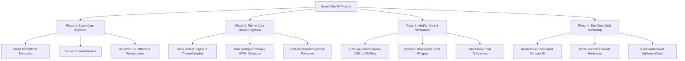

# BÁO CÁO TỔNG HỢP TOÀN DIỆN (SYNTHESIS REPORT)
## ĐỀ XUẤT CẢI TIẾN CHO SUPER CORE VÀ HARAVAN THEME CORE OUTPUT
**Căn cứ:** Dữ liệu trinh sát chuyên sâu (Ultra Scout) từ **69 dự án thực tế** tại `E:\Work`:
- **32 dự án tùy biến storefront (Customizes):** *Seahorse2, FarmerMarket, Uncommon, KellyPerfume, Phukienmaymoc, GixJewel, GomDatViet, Thietbihoaphat, Mulgati, Bagamuioto, Tototuantu, OwlBrand, Hapas, Apshop, Toda, Mnbakery, Rosemine, Reebaby, Vyantechnology, TestVyan, Iamhome, CuddlePet, Eiddo, Sunriseplus, StylekoreanVietNam, Starsolution, SittoVietnam, Remolacha, Luxvie, Kome88, Dangvietmart, Zesta*.
- **16 dự án giao diện gốc (Themes):** *f1genz/Haravan (Aqua, Figure, Fresh, GenZ, Hera Jewelry, Laptop, PC, An Vat); f1genz/Sapo (GENZ); devs2 (Healing Touch, Ivory Gem, Lumiere Beauty, NauAtelier, S2 Spa, S2Bed); ref (Dressly_final_new)* cùng hệ thống quy tắc lỗi `themes/bugs/chung.md`.
- **21 dự án ứng dụng & công cụ nền tảng (Apps & Tooling):** *haravan-app-base, notify-everything, f1genz-helper, pancake, f1genz-multiform, f1genz-feedback, haravan-cli, sapo-cli, f1genz-chatbox, f1genz-orders, f1genz-guarantee, f1genz-tools, antigravity-browser, f1genz-review, webhook-gateway, f1genz-collection-tab, f1genz-review-sapo, f1genz-wheel, multi-redirect, f1genz-multipage, f1genz-multilanguage*.

---

# PHẦN 1: CẢI TIẾN CỐT LÕI CHO SUPER CORE (`@antifan/super-core`)

Super Core (`packages/super-core`) đóng vai trò là "bộ não" tri thức chứng cứ cục bộ (Local-first Evidence & Provenance Store), cung cấp Context Pack, Adjudication, Anti-Patterns, Fix Patterns, Workarounds và Platform Semantics cho toàn bộ hệ thống AntiFan.

### 1.1. Cập nhật & Bổ sung Platform Semantics (`platform_semantics`)

Từ 21 app và 48 themes/customizes, Super Core cần nạp các đặc tả thực tế (Platform Ground Truth) mà tài liệu chính thức của nền tảng thường bỏ sót hoặc mô tả sai lệch:

| ID | Nền tảng | Chủ đề | Sự thật nền tảng (Fact) | Chứng cứ mã nguồn / Thực nghiệm |
|---|---|---|---|---|
| `PS-HRV-001` | `haravan` | `auth_hmac` | **Launch HMAC dùng thứ tự query gốc, KHÔNG sắp xếp A-Z.** Khác với Shopify (sắp xếp key alphabet), Haravan tính HMAC trên chuỗi query thô theo thứ tự trình duyệt gửi tới; phải thử cả 2 ứng viên: raw URL-encoded và decoded pairs. | `haravan-app-base/src/haravan/hmac-verifier.service.ts`, `F1GENZ Orders`, `F1GENZ Wheel` |
| `PS-HRV-002` | `haravan` | `metafield_type` | **Endpoint `/web/*` cấm `value_type: 'json'` (lỗi 422).** Các tài nguyên nội dung (`pages`, `blogs`, `articles`) chỉ chấp nhận `value_type: 'string'`, trong khi `/com/*` (`products`, `collections`) chấp nhận `'json'`. Giá trị payload đều là chuỗi JSON serialize. | `F1GENZ Collection Tab/src/haravan.util.ts:121-135`, báo cáo debug HAR `debug-260715-0054` |
| `PS-HRV-003` | `haravan` | `metafield_immutability` | **`value_type` của Metafield là bất biến sau khi tạo.** Không thể `PUT` sửa `value_type` từ `string` sang `json` (hoặc ngược lại); Haravan sẽ trả về 422. Bắt buộc phải `DELETE` rồi `POST` tạo lại. | `F1GENZ Multipage/src/metafield/metafield.service.ts` |
| `PS-HRV-004` | `haravan` | `metafield_limit` | **Giới hạn dung lượng Metafield thực tế là ~64KB - 80KB.** Vượt quá ngưỡng này API sẽ từ chối hoặc cắt cụt payload. Giải pháp chuẩn là nén chunking (`chunk_1`, `chunk_2` ≤ 60KB) và xóa triệt để chunk thừa khi dữ liệu co lại. | `F1GENZ Review/review-metafield.service.ts` (60KB chunk), `F1GENZ Collection Tab` (64KB budget) |
| `PS-HRV-005` | `haravan` | `metafield_lag` | **Độ trễ đọc-sau-khi-ghi (Read-after-write Replication Lag) từ 1.2s - 2.5s.** Ghi Metafield thành công nhưng `GET` ngay sau đó vẫn trả về dữ liệu cũ. Cần settle ≥ 1200ms và revalidate ≥ 2500ms trước khi kiểm tra storefront. | `F1GENZ Collection Tab/MetafieldsService.js` |
| `PS-HRV-006` | `haravan` | `token_rotation` | **Haravan Refresh Token xoay vòng (Rotate) mỗi lần refresh.** Mỗi khi đổi `refresh_token` lấy `access_token` mới, token cũ lập tức bị vô hiệu. Bắt buộc phải có Distributed Lock (`SET NX EX:30`) và đọc lại token mới nhất trước khi ghi đè, tránh race condition giữa Cron và Request. | `F1GENZ Orders/haravan.service.ts`, `haravan-app-base` |
| `PS-HRV-007` | `haravan` | `webhook_headers` | **Webhook HMAC ký trên Raw Body bằng Client Secret (hoặc Webhook Secret song song).** Header là `x-haravan-hmacsha256` (Base64 hoặc Hex 64 ký tự). Topic có hiện tượng alias trôi dạt (`app_uninstall_webhook` vs `app/uninstalled`, `canceled` vs `cancelled`). | `notify-everything`, `webhook-gateway`, `F1GENZ Review` |
| `PS-SAPO-001` | `sapo` | `liquid_slice` | **Filter `\| slice` gây crash fatal .NET LINQ trên Sapo DotLiquid.** Cấm tuyệt đối `\| slice` trên theme Sapo/Bizweb (`.bwt`). Phải thay thế bằng `truncate`, `split` hoặc vòng lặp. | `sapo-cli/sapo-liquid-dialect.ts`, `themes/bugs/chung.md` |
| `PS-SAPO-002` | `sapo` | `cart_product_url` | **`line_item.url` bị thiếu trên Sapo.** Phải dùng chuẩn `line_item.product.url` để tránh link giỏ hàng trỏ về rỗng hoặc 404. | `sapo-cli`, `theme-qa-az` |
| `PS-SAPO-003` | `sapo` | `form_contact` | **Form liên hệ Sapo phải submit về `/postcontact`.** Không dùng submit mặc định như Haravan hay Shopify. | `sapo-cli`, `F1GENZ Review Sapo` |
| `PS-SAPO-004` | `sapo` | `rate_limit` | **Sapo dùng Leaky Bucket 40 calls, leak 2 rps.** Kiểm soát qua cặp header `x-sapo-shop-api-call-limit` hoặc `x-bizweb-shop-api-call-limit`. Cần reactive sleep khi chạm 85% (600ms) và 95% (1500ms). | `sapo-cli/sapo_api.ts` |
| `PS-SAPO-005` | `sapo` | `binary_attachment` | **PUT binary asset lên Sapo cần Base64 kèm ký tự `\n` ở cuối.** API Sapo upload binary không ổn định, cần verify-GET với 3 lần thử lại và chuẩn hóa khoảng trắng base64. | `sapo-cli/files.ts` |

---

### 1.2. Thư viện Anti-Patterns (`anti_patterns`) Cần Nạp Ngay

Dưới đây là 10 Anti-Patterns xuất hiện lặp lại nhiều lần trong các ứng dụng thực tế, gây sập hệ thống hoặc làm sai lệch kết quả:

1. **`AP-AUTH-001: OrgId-As-ShopId Tenant Confusion`**
   - *Triệu chứng:* Dùng trực tiếp `orgid` từ session token làm Foreign Key / Shop ID cho dữ liệu nghiệp vụ (VD: `KnowledgeDoc`, `ProductSettings`).
   - *Hậu quả:* Dữ liệu của merchant bị lưu dưới key sai lệch, công cụ tìm kiếm public không thể truy vấn ra, xóa nhầm tài liệu giữa các tenant.
   - *Khắc phục:* Bắt buộc resolve `Shop.id` từ `orgid` thông qua database lookup ở đầu mỗi request trước khi thực hiện CRUD.
   - *Chứng cứ:* `F1GENZ Chatbox/knowledge.controller.ts` (4 vị trí gọi nhầm).

2. **`AP-AUTH-002: Header/Query Tenant Trust Without HMAC Verification`**
   - *Triệu chứng:* Nhận diện cửa hàng hoặc tenant chỉ dựa vào query param `shop` hoặc header `x-store-domain` mà không kiểm tra chữ ký HMAC hoặc Bearer token.
   - *Hậu quả:* Bất kỳ ai cũng có thể giả mạo cửa hàng để đọc lén danh sách đơn hàng, bảo hành hoặc gửi spam đánh giá.
   - *Khắc phục:* Xác thực nghiêm ngặt bằng JWT session, HMAC launch query hoặc origin allowlist đối soát với danh sách domain đã đăng ký (`ShopDomain`).
   - *Chứng cứ:* `F1GENZ Review Sapo/public-review.controller.ts`, `WebhookGateway/webhook.controller.ts`.

3. **`AP-GATE-001: Always-200 Ingress Swallowing System Outages`**
   - *Triệu chứng:* Webhook Ingress hoặc Form Ingress bắt mọi ngoại lệ (HMAC sai, DB sập, timeout) và luôn trả về `HTTP 200 { ok: false }`.
   - *Hậu quả:* Nền tảng (Haravan/Sapo) coi như webhook đã giao thành công và KHÔNG BAO GIỜ thử lại; dữ liệu đơn hàng / khách hàng bị mất vĩnh viễn trong thời gian DB gặp sự cố.
   - *Khắc phục:* Trả về 200 khi đã commit vào queue bền vững; trả về 5xx khi lỗi hạ tầng để nền tảng tự động backoff retry; trả về 4xx khi HMAC không hợp lệ.
   - *Chứng cứ:* `WebhookGateway/webhook-ingress.service.ts`.

4. **`AP-UI-001: Generic Beautifier on Liquid Source Inside <style>/<script>`**
   - *Triệu chứng:* Dùng trực tiếp `js-beautify` (kể cả có bật `django/handlebars`) trên mã nguồn Liquid có chứa thẻ lồng trong thẻ `<style>` hoặc `<script>`.
   - *Hậu quả:* Cú pháp `{{ settings.color }}` bị tách dòng thành `{ \n { settings.color } \n }`, làm vỡ toàn bộ CSS Custom Properties và JSON config.
   - *Khắc phục:* Kỹ thuật **Protect-Transform-Restore**: Thay thế toàn bộ `` và `{{ }}` trong khối style/script bằng placeholder an toàn `___LQ_N___` trước khi beautify, sau đó restore lại nguyên vẹn và kiểm tra Structural Safety Fingerprint (tổng số thẻ `{{` và `{ %` không đổi).
   - *Chứng cứ:* `F1GENZ Tools/page-script.js`, `test.scss`.

5. **`AP-ROUTER-001: Unvalidated Placeholder Branches in Liquid Router`**
   - *Triệu chứng:* Tạo router đa ngôn ngữ hoặc theme switcher bằng `` nhưng để nhánh rác/test (như ``).
   - *Hậu quả:* Nhánh ngôn ngữ tiếng Anh/phụ bị cô lập vĩnh viễn, toàn bộ khách quốc tế bị rớt về trang tiếng Việt mặc định.
   - *Khắc phục:* Trình biên dịch phải đối soát 1-1 danh sách ngôn ngữ cấu hình với các nhánh `` và sự tồn tại vật lý của file snippet `theme_{prefix}.liquid`.
   - *Chứng cứ:* `F1GENZ MultiLanguage/storefront/layout/theme.liquid`.

6. **`AP-DATA-001: Poison XLSX Unchecked Stream Reader`**
   - *Triệu chứng:* Dùng ExcelJS WorkbookReader đọc file mà giả định thứ tự entry trong file zip luôn chuẩn (`workbook.xml` trước `sheet1.xml`).
   - *Hậu quả:* Với các file Excel do người dùng tạo hoặc xuất từ phần mềm bên thứ 3 có entry `sheet.xml` đứng trước, ExcelJS văng lỗi `Cannot read properties of undefined (reading 'model')` và treo toàn bộ tiến trình import.
   - *Khắc phục:* Chạy unzipper pre-pass quét qua `sharedStrings.xml` và cấu trúc sheet trước khi pipe vào ExcelJS; monkey-patch getter `model` phòng thủ.
   - *Chứng cứ:* `F1GENZ Guarantee/excel-import.service.ts`, `adversarial-zip-order.test.ts`.

7. **`AP-STORE-001: Redis-Only Critical State Without TTL Bounds`**
   - *Triệu chứng:* Lưu trạng thái tiến trình chạy (VD: `sync:status:{orgid} = 'running'`) thuần túy trên Redis mà không có DB backup và không có heartbeat TTL.
   - *Hậu quả:* Khi server bị restart hoặc crash giữa chừng, trạng thái `'running'` tồn tại vĩnh viễn, cửa hàng không bao giờ đồng bộ lại được.
   - *Khắc phục:* Đặt TTL ngắn hạn kèm Dead-man switch / Heartbeat, hoặc lưu trạng thái vào Postgres kèm cờ cập nhật thời gian.
   - *Chứng cứ:* `F1GENZ Chatbox/sync.service.ts`.

8. **`AP-THEME-001: Schema Block in Haravan Themes`**
   - *Triệu chứng:* Mang thói quen từ Shopify viết thẻ `` vào file section của Haravan.
   - *Hậu quả:* Trình phân tích DotLiquid của Haravan báo lỗi cú pháp hoặc bỏ qua hoàn toàn.
   - *Khắc phục:* Haravan dùng file cấu hình tập trung `config/settings_schema.json` (chuẩn F1GENZ) hoặc `config/settings.html` (chuẩn Haravan cũ dạng `fieldset > legend > table > tr > td`).
   - *Chứng cứ:* `themes/CLAUDE.md`, `F1GENZ Tools/SKILL.md`.

9. **`AP-CACHE-001: Stale Token Cache Key Surviving Rotation`**
   - *Triệu chứng:* Cache dữ liệu API bằng key không gắn liền với phiên bản token (VD: `cache:products:{shop}`).
   - *Hậu quả:* Sau khi merchant xoay vòng token hoặc cài lại app, cache vẫn trả về dữ liệu cũ hoặc cố dùng token cũ gây lỗi 401 hàng loạt.
   - *Khắc phục:* Đưa hash của token vào cache key: `cache:data:{sha1(token)[:16]}:{productId}` để tự động hủy cache khi token đổi.
   - *Chứng cứ:* `F1GENZ Review/review-metafield.service.ts`.

10. **`AP-FRONT-001: Dual-extension Liquid Assets Mangled by Localizer`**
    - *Triệu chứng:* Các file `.js.liquid`, `.css.liquid`, `.scss.liquid` bị trình tải asset coi là asset tĩnh và tự động ghi đè hoặc loại bỏ biểu thức Liquid `{{ 'filename.png' \| asset_url }}`.
    - *Hậu quả:* Vỡ giao diện runtime vì link ảnh biến thành chuỗi rác.
    - *Khắc phục:* Phân loại rõ ràng danh sách extension lai và giữ nguyên biểu thức Liquid trong quá trình bundle.
    - *Chứng cứ:* `F1GENZ Orders/storefront`, `themes/devs2/Ivory Gem`.

---

### 1.3. Thư viện Mẫu Sửa Lỗi Chuẩn Hóa (`fix_patterns`)

1. **Race-Safe Inventory & Prize Grant Pattern (Chứng minh tại `F1GENZ Wheel`):**
   - *Mục tiêu:* Cấp phát quà/coupon/mã kích hoạt không bị âm kho dưới tải cao (concurrency).
   - *Quy trình:* `SELECT Player FOR UPDATE` -> kiểm tra hạn mức lượt chơi trong ngày theo UTC -> `UPDATE PrizeSlot SET remaining = remaining - 1 WHERE id = :id AND remaining > 0` -> `UPDATE Coupon SET status = 'issued' WHERE id = :cid AND status = 'available'` -> Nếu conflict thì loại slot đó ra và bốc thăm lại (tối đa 8 lần thử) trước khi chuyển thành lượt quay hụt.

2. **Multi-Candidate HMAC Verification Matrix (Chứng minh tại `haravan-app-base` & `F1GENZ Multipage`):**
   - *Mục tiêu:* Chống rớt xác thực app launch do sự không nhất quán giữa các trình duyệt và cổng Haravan Admin.
   - *Quy trình:* Chạy tích ma trận 4 trường hợp (Query thô ban đầu / Query sắp xếp A-Z) × (URL-encoded / URL-decoded) × (Danh sách secret: App Secret, Client Secret) với hàm so sánh an toàn `timingSafeEqual`.

3. **Post-Save Content Fingerprint Polling (Chứng minh tại `F1GENZ Multipage`):**
   - *Mục tiêu:* Tránh hiển thị dữ liệu cũ trong Iframe Live Preview khi Haravan storefront lag cache.
   - *Quy trình:* Tính mã băm DJB2 của nội dung `<body>` (loại bỏ các thẻ script, style, nonce, cache-buster) -> poll định kỳ từ 500ms đến 800ms cho đến khi mã băm thay đổi -> reload preview mượt mà bằng kỹ thuật Dual-Iframe Double Buffer.

4. **Deterministic Webhook Idempotency Tri-State (Chứng minh tại `WebhookGateway` & `F1GENZ Review`):**
   - *Mục tiêu:* Xử lý an toàn khi nhà mạng gửi lặp lại webhook nhiều lần.
   - *Quy trình:* Khóa duy nhất `@@unique(topic, orgid, payloadHash)`. Khi insert gặp P2002: kiểm tra trạng thái hiện tại (nếu `processing` -> báo duplicate; nếu `failed` -> cho phép chạy lại; nếu `processed` -> bỏ qua an toàn).

5. **Dual-Storage Contract: Structured JSON + Canonical Delimiter String (Chứng minh tại `F1GENZ Collection Tab`):**
   - *Mục tiêu:* Hỗ trợ đồng thời cả theme hiện đại (lặp `tab.items`) và theme cũ B2B (tách chuỗi `split: '[title]'`).
   - *Quy trình:* Lưu trữ đồng thời trường `items: [{ title, content, image }]` và chuỗi chuẩn hóa `content: "[title]...[/title][content]...[/content]"`.

---

# PHẦN 2: CẢI TIẾN CHO HARAVAN THEME CORE OUTPUT (`ThemeCompiler` & `HaravanSchemaGenerator`)

Theme Core Output trong AntiFan (`packages/site-clone/src/generators/`) chịu trách nhiệm tạo ra cây thư mục giao diện chuẩn (Liquid 7-directory structure) từ bản clone hoặc bản thiết kế.

### 2.1. Cải tiến Trình biên dịch Theme (`ThemeCompiler`)

1. **Tích hợp Bộ phân tích Dialect Sapo (`sapo-liquid-dialect`) trực tiếp vào Pipeline:**
   - Khi cờ nền tảng là `sapo`:
     - Tự động quét và chuyển đổi `{{ x \| slice: a, b }}` thành vòng lặp hoặc bộ lọc an toàn `truncate`.
     - Chuyển `line_item.url` -> `line_item.product.url`.
     - Chuyển action form liên hệ từ `/contact` -> `/postcontact`.
     - Tự động xuất file đuôi `.bwt` thay cho `.liquid`.
     - Chuẩn hóa tên thư mục từ số nhiều (`layouts/`, `configs/`) về số ít chuẩn (`layout/`, `config/`).
2. **Cơ chế Bảo vệ Biểu thức Liquid Đa Tầng (`Protect-Transform-Restore`):**
   - Khi định dạng hoặc minify HTML/CSS/JS, cấm chạy trực tiếp trên file có Liquid.
   - Tích hợp pipeline của `F1GENZ Tools`: gom tất cả thẻ `{{ ... }}` và `` vào bảng băm tạm thời `___LQ_TOKEN_N___`, sau đó mới format, và khôi phục lại ở bước cuối.
   - Kiểm tra **Structural Safety Fingerprint**: Tổng số lượng dấu ngoặc `{{`, `}}`, `` trước và sau khi build phải bằng nhau tuyệt đối. Nếu lệch, lập tức hủy bản build và báo cảnh báo.
3. **Phát hiện Cú pháp Lỗi Split Delimiters:**
   - Quét regex `/\{\s+%|%\s*\}/` trên toàn bộ template trước khi xuất xưởng để loại trừ lỗi gõ sai `{ %` (như phát hiện tại `template04.liquid` của F1GENZ Multipage).
4. **Tự động gắn cờ `server_rendered` cho các thuộc tính Liquid:**
   - Trong quá trình parse cây DOM/Liquid, mọi setting ID được tham chiếu bên trong các thẻ ``, ``, `collections[...]`, `linklists[...]` phải được gắn cờ `server_rendered: true` trong schema JSON, giúp builder giao diện biết được trường nào cần reload server, trường nào có thể live-patch bằng DOM JS.

### 2.2. Cải tiến Trình tạo Schema (`HaravanSchemaGenerator`)

1. **Hỗ trợ Song song 2 Chuẩn Cấu hình Haravan:**
   - **Chuẩn F1GENZ Hiện đại:** Tạo file `config/settings_schema.json` chứa các block cài đặt có cấu trúc mảng (`name`, `settings: [...]`), hỗ trợ thuộc tính data binding trực tiếp trên DOM storefront (`setting-id="header_bg"`).
   - **Chuẩn Haravan Truyền thống:** Tạo file `config/settings.html` thuần HTML sử dụng cấu trúc bảng compact:
     ```html
     <fieldset>
       <legend>Header Configuration</legend>
       <table>
         <tr>
           <td><strong>Màu nền header</strong></td>
           <td><input type="text" name="header_bg_color" value="#ffffff" class="color" /></td>
         </tr>
       </table>
     </fieldset>
     ```
   - Tuyệt đối không sinh mã Liquid bên trong `settings.html`.
2. **Loại bỏ Hoàn toàn Cài đặt Rác (Dead Settings):**
   - Đối chiếu danh sách key trong `settings_schema.json` với toàn bộ biến được gọi trong `layout/*.liquid`, `templates/*.liquid`, `snippets/*.liquid`.
   - Cắt bỏ mọi setting không có nơi tiêu thụ để tránh làm phình file `settings_data.json` (từng ghi nhận tới 239KB dữ liệu thừa trong các theme cũ).

### 2.3. Chuẩn hóa Hợp đồng Nhúng App (App Embed & Widget Contract)

Các ứng dụng của F1GENZ nhúng vào theme theo 3 hình thức chuẩn; ThemeCompiler cần nhận biết và xử lý đúng:
1. **Light DOM Custom Elements (`<f1genz-*>`):**
   - VD: `<f1genz-reviews product-id="{{ product.id }}">`, `<f1genz-rating-badge>`.
   - Trình duyệt dựng giao diện dạng Light DOM (không dùng Shadow DOM) để kế thừa CSS màu sắc của theme.
   - DOM Sanitizer phải giữ nguyên thẻ tùy biến dạng `[a-z]+-[a-z]+` và các thuộc tính dữ liệu `data-f1genz-runtime-owned`.
2. **Thẻ nhúng theo Cặp có Thứ tự (Ordered Script Pair):**
   - VD: F1GENZ Chatbox yêu cầu:
     ```html
     <script>window.F1GENZ_CHATBOX_CONFIG = { apiBaseUrl: '...', shopDomain: '{{ shop.domain }}' };</script>
     <script src="https://cdn.f1genz.dev/chatbox.js" async></script>
     ```
   - Trình nén JS hoặc noPS tuyệt đối không được hoán đổi thứ tự chạy của 2 thẻ này.
3. **Kênh Cấu hình Qua Shop Metafield:**
   - Các app truyền API URL và token về theme thông qua `shop.metafields.f1genz.config`.
   - ThemeCompiler cần tạo đoạn code phòng thủ:
     ```liquid
     
       <script>window.__F1GENZ_STOREFRONT_CONFIG = {{ shop.metafields.f1genz.config.value | json }};</script>
     
     ```

---

# PHẦN 3: CẢI TIẾN CHO ANTIFAN CORE (CDP, BROWSER AUTOMATION & VERIFICATION)

AntiFan Desktop Core điều khiển Chromium và thực hiện thẩm tra trực tiếp trên trình duyệt thật.

### 3.1. Nâng cấp Bộ đo Telemetry & Xử lý Độ trễ

1. **Khắc phục Độ trễ Ghi Đọc Haravan Metafield:**
   - Trong `anti.trace.interaction` và `anti.verification.verify_claim`: Khi kích hoạt một tương tác lưu dữ liệu lên API Haravan (VD: lưu tabs, đổi cài đặt app), công cụ CDP phải tự động chờ tối thiểu **1200ms** trước khi lấy DOM snapshot và tối thiểu **2500ms** trước khi reload trang, loại bỏ triệt để tình trạng báo lỗi giả do Haravan database replication lag.
2. **Nhận diện và Xuyên thủng Shadow DOM / Editor Trình duyệt:**
   - Kế thừa giải pháp từ `F1GENZ Tools`: Bổ sung cơ chế duyệt cây DOM đâm xuyên qua Shadow Root (`queryAllDeep` / `getRootNode().host`) để thu thập snapshot tại các vùng biên tập CodeMirror 6, Monaco, Ace Editor trong trang quản trị Haravan.
3. **Mặt nạ Che Phủ Động (Dynamic Masking Policy):**
   - Trong các công cụ so khớp ảnh `anti.visual.compare` và `anti.screenshot.full_page`: Tự động áp dụng mặt nạ (masking) lên các phần tử nổi cố định (`position: fixed`, `z-index ≥ 9999`) có trạng thái nhấp nháy/hoạt họa như `#f1genz-chatbox-root`, `.f1genz-wheel-popup`, `f1genz-toast`. Không để sự thay đổi khung chat làm hỏng kết quả so sánh pixel giữa 2 phiên bản giao diện.

### 3.2. Mở rộng Hệ thống Bằng chứng Kiểm định (`anti.verification.record_claim`)

Bổ sung các loại Claim Type mới dựa trên lỗi thực tế từ các app:
- `CLAIM_PUBLIC_API_SHAPE`: Kiểm định cấu trúc trả về của API Storefront (VD: trả về mảng hay trả về object phân trang `{ items, total }`, tránh lỗi trắng trang của `F1GENZ Review Sapo`).
- `CLAIM_WIDGET_CONTRACT`: Kiểm định sự khớp nối giữa dữ liệu phản hồi từ server và text hiển thị trên widget (bắt lỗi kinh điển `result.prize` của `F1GENZ Wheel`).
- `CLAIM_LOCALE_ROUTER_REACHABILITY`: Kiểm định rằng khi shopper chuyển ngôn ngữ bằng cart attribute, giao diện thực sự đổi layout chứ không rơi vào nhánh router rác.
- `CLAIM_TAG_COUNT_INVARIANT`: Kiểm định tính bất biến của số lượng thẻ Liquid sau khi code chạy qua các bộ chuyển đổi / nén code.

---

# PHẦN 4: CẢI TIẾN CHO SITE CLONE (`@antifan/site-clone`)

Site Clone đảm nhiệm việc tải và tái cấu trúc một website nguồn thành giao diện độc lập hoặc theme Haravan hoàn chỉnh.

### 4.1. Cập nhật Mô hình Trung gian Component Contract IR (v2.0)

Mở rộng schema `clone-ir.ts` và `qa-matrix.schema.json`:
1. **Bổ sung Trường `redirects` vào IR:**
   - Căn cứ từ phát hiện tại `Multi Redirect`: Quá trình clone URL thường loại bỏ đuôi `.html`, `.htm` hoặc đổi slug. Nếu không lưu trữ danh sách redirect, toàn bộ link cũ của khách hàng sẽ bị lỗi 404 khi đưa theme vào hoạt động.
   - Thêm trường `redirects: Array<{ path: string, target: string, reason: string }>` vào `ThemeBundleIR`.
2. **Phân loại Node Dịch Vụ Ngoài (`External Embed Node`):**
   - Không chuyển các widget chatbox, vòng quay may mắn hoặc form khảo sát thành HTML tĩnh.
   - Đánh dấu chúng trong IR dưới dạng `kind: 'external_embed'` kèm thông tin cấu hình (`apiBaseUrl`, `scriptSrc`, `fallbackState`), cho phép clone ở chế độ Offline Standalone bằng cách hiển thị mockup hoặc stub dữ liệu giả lập.

### 4.2. Bộ lọc DOM Sanitizer Đa Nền tảng

1. **Khử Bỏ Endpoint Cứng (Legacy Fallback URLs):**
   - Rất nhiều app nhúng có đoạn code gọi về domain cố định khi thiếu config (VD: `https://api-haravan-reviews.f1genz.dev`, `https://api-sapo-reviews.f1genz.dev`).
   - DOM Sanitizer và Asset Localizer phải quét và trung hòa các URL này, thay thế bằng biến môi trường hoặc cảnh báo vi phạm độc lập trong bản clone.
2. **Bảo toàn Thuộc tính Dữ liệu Runtime:**
   - Bảo toàn các thuộc tính `data-f1genz-*`, `setting-id`, `setting-type` trên các thẻ HTML để trình soạn thảo trực quan Haravan Editor có thể tương tác được sau khi clone.

### 4.3. Cổng Nghiệm thu Chất lượng (Definition of Done - DoD Validator)

Bổ sung 5 tiêu chí kiểm định bắt buộc trước khi đóng gói theme xuất xưởng:
1. **Không chứa ký tự phân tách thô:** Kiểm tra toàn bộ text node để đảm bảo không còn sót các token rác dạng `[title]`, `[badge]`, `[content]` chưa được render.
2. **Không chứa mã bí mật rác:** Kiểm tra toàn bộ script tag để đảm bảo không bị lộ `key=`, `shopKey=`, `access_token` từ theme nguồn.
3. **Dialect Parity trên Sapo:** Tuyệt đối không có sự xuất hiện của `| slice` trong các file `.bwt`.
4. **Kiểm tra Ký tự BOM (Byte Order Mark):** Phát hiện và loại bỏ ký tự BOM `\uFEFF` ở đầu file JSON và Liquid để tránh lỗi vỡ JSON parser trên Haravan API.
5. **Kiểm tra File Kép (Dual Extension Integrity):** Xác nhận các file `.js.liquid`, `.css.liquid` giữ nguyên vẹn các hàm Liquid `asset_url` và không bị nén nhầm thành file tĩnh thuần túy.

---

# TỔNG KẾT VÀ LỘ TRÌNH THỰC THI (ACTIONABLE ROADMAP)



Toàn bộ dữ liệu chi tiết của từng dự án hiện đã được lưu trữ độc lập tại `E:\Work\apps\AntiFan\reports/` để phục vụ tra cứu chi tiết và trích xuất bằng chứng (Evidence Anchors) bất kỳ lúc nào.
